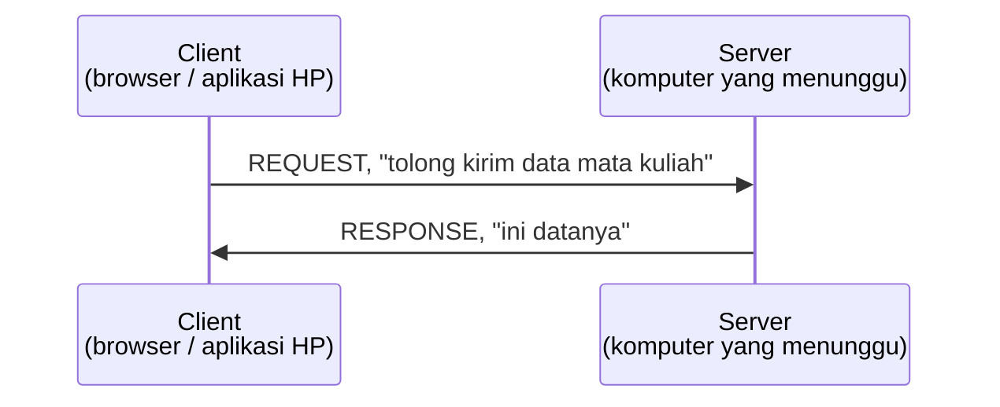

[← Bab 00 Persiapan](00-persiapan.md) · [Daftar isi](README.md) · [Bab 02 Go Dasar →](02-golang-dasar.md)

# Bab 01: Backend Dasar

Bab ini tidak memuat kode. Isinya istilah dasar yang dipakai di bab-bab berikutnya.

## Analogi restoran

Analogi ini dipakai berulang sampai bab terakhir.


| Bagian restoran                                                            | Padanannya                                             |
| ---------------------------------------------------------------------------- | -------------------------------------------------------- |
| **Ruang makan**: tempat pelanggan duduk, membaca menu, memesan           | **Frontend**: yang dilihat dan disentuh pengguna     |
| **Dapur**: menerima pesanan, mengolah, mengirim hasil keluar             | **Backend**: yang memproses, tidak terlihat pengguna |
| **Gudang bahan**: menyimpan bahan, isinya tetap ada walau restoran tutup | **Database**: menyimpan data secara permanen         |

Aturan pentingnya: **pelanggan tidak pernah
masuk ke dapur, dan tidak pernah mengambil sendiri bahan dari gudang.** Semua
permintaan lewat pelayan.

Aturan itu yang nanti menjelaskan kenapa kode backend dipecah ke banyak folder
(bab 08), dan kenapa frontend tidak boleh mengakses database secara langsung.

## Client dan Server

Setiap kali aplikasi dibuka, ada dua pihak yang berkirim pesan.



**Client selalu yang memulai percakapan.** Server tidak pernah mengirim apa pun
lebih dulu; ia menunggu, lalu menjawab.

Karena itu server harus terus menyala. Saat `go run` dijalankan, terminal tidak
kembali ke prompt: server sedang menunggu request, bukan hang. Hentikan dengan
`Ctrl+C`.

## Isi sebuah request

Request berisi tiga hal:


| Bagian     | Pertanyaan yang dijawab | Contoh                                |
| ------------ | ------------------------- | --------------------------------------- |
| **Method** | Mau melakukan apa?      | `POST`                                |
| **URL**    | Ke bagian mana?         | `/mata-kuliah`                        |
| **Body**   | Data apa yang dibawa?   | `{"kode": "IF2010", "nama": "Alpro"}` |

Response berisi dua hal:


| Bagian     | Pertanyaan yang dijawab     | Contoh                        |
| ------------ | ----------------------------- | ------------------------------- |
| **Status** | Berhasil atau tidak?        | `201`                         |
| **Body**   | Data apa yang dikembalikan? | `{"id": 1, "kode": "IF2010"}` |

### Melihat request asli

Tanpa menulis kode:

1. Buka website apa saja di browser
2. Tekan `F12` untuk membuka DevTools
3. Pilih tab **Network**
4. Refresh halamannya
5. Klik salah satu baris yang muncul

Panel yang muncul menampilkan Method, URL, Status, dan Response body, sesuai
tabel di atas.

## Empat kata kerja

Method adalah niat dari sebuah request. Hampir semua yang dilakukan aplikasi
jatuh ke salah satu dari empat ini:


| Method   | Artinya                  | Di restoran      | Istilah CRUD |
| ---------- | -------------------------- | ------------------ | -------------- |
| `GET`    | Ambil / lihat data       | Lihat menu       | **R**ead     |
| `POST`   | Kirim data baru          | Pesan makanan    | **C**reate   |
| `PUT`    | Ubah data yang sudah ada | Ganti pesanan    | **U**pdate   |
| `DELETE` | Hapus data               | Batalkan pesanan | **D**elete   |

**CRUD** = Create, Read, Update, Delete. Keempat operasi ini ditulis kodenya
mulai bab 03.

## Angka jawaban server

Setiap response membawa satu angka yang meringkas hasilnya. Kelompok angkanya
sudah menjelaskan banyak:


| Kelompok | Artinya                 | Contoh yang sering muncul                                                           |
| ---------- | ------------------------- | ------------------------------------------------------------------------------------- |
| **2xx**  | Berhasil                | `200` OK: permintaan sukses; `201` Created: data baru terbuat                     |
| **4xx**  | Salah di sisi**client** | `400` Bad Request: data kiriman tidak valid; `404` Not Found: alamatnya tidak ada |
| **5xx**  | Salah di sisi**server** | `500` Internal Server Error: kode kita yang bermasalah                            |

**4xx berarti kiriman client salah, 5xx berarti kode server bermasalah.** Angka
ini menunjukkan di sisi mana kesalahan harus dicari.

`404` saat menjalankan server sendiri bukan berarti gagal. Server hidup dan
menjawab, hanya saja alamat yang dibuka belum dibuat.

## API

API adalah daftar permintaan yang boleh diajukan ke sebuah server. Seperti menu
di restoran.


| Menu memberi tahu          | API memberi tahu                       |
| ---------------------------- | ---------------------------------------- |
| Apa saja yang bisa dipesan | Alamat apa saja yang tersedia          |
| Bagaimana cara memesannya  | Method dan data apa yang harus dikirim |
| Apa yang akan diterima     | Response seperti apa yang dibalas      |

Yang **tidak** diberitahukan: menu tidak memuat cara memasak, API tidak memuat
isi kode.

Dengan adanya API, tim frontend dan backend bisa bekerja terpisah setelah
menyepakati kontraknya. Aplikasi cuaca di ponsel tidak punya alat ukur suhu; ia
memanggil API penyedia data cuaca.

## JSON

Format yang dipakai untuk menulis data yang dikirim bolak-balik. Bentuknya seperti ini:

```json
{
  "id": 1,
  "kode": "IF2010",
  "nama": "Algoritma dan Pemrograman",
  "sks": 4,
  "tersedia": true
}
```

Aturannya:

- Data ditulis berpasangan `"nama": nilai`
- Nama selalu diapit tanda kutip ganda
- Nilai bisa berupa teks (`"Alpro"`), angka (`4`), benar/salah (`true`), atau
  daftar (`[...]`)
- Antar pasangan dipisah koma, dan **tidak ada koma setelah pasangan terakhir**

Koma berlebih di akhir adalah penyebab error JSON paling sering. Periksa itu
lebih dulu saat Postman menolak JSON.

Daftar beberapa data ditulis dalam kurung siku:

```json
[
  { "id": 1, "kode": "IF2010" },
  { "id": 2, "kode": "IF2020" }
]
```

## Kenapa perlu database

Data bisa saja disimpan di variabel program. Perbandingannya:


| Disimpan di variabel                               | Disimpan di database                                 |
| ---------------------------------------------------- | ------------------------------------------------------ |
| Data hidup di memori (RAM) selama program berjalan | Data ditulis ke penyimpanan permanen di luar program |
| Server dimatikan →**semua data hilang**           | Server dimatikan →**data tetap aman**               |

Istilahnya **persistence**.

Bab 03 sengaja menyimpan data di variabel lebih dulu, agar masalahnya terlihat
langsung: matikan server, jalankan lagi, datanya hilang.

---

## Ringkasan

- Backend adalah dapur: memproses permintaan, tidak terlihat pengguna
- Client selalu memulai, server menunggu dan menjawab
- Request berisi **method + URL + body**; response berisi **status + body**
- Empat method utama: `GET` `POST` `PUT` `DELETE`: dikenal sebagai CRUD
- Status `2xx` berhasil, `4xx` salah kirim dari client, `5xx` kode server bermasalah
- API adalah daftar permintaan yang boleh diajukan, seperti menu
- JSON adalah format datanya; hati-hati koma berlebih
- Database dipakai supaya data tidak hilang saat server mati

---

[← Bab 00 Persiapan](00-persiapan.md) · [Daftar isi](README.md) · [Bab 02 Go Dasar →](02-golang-dasar.md)
