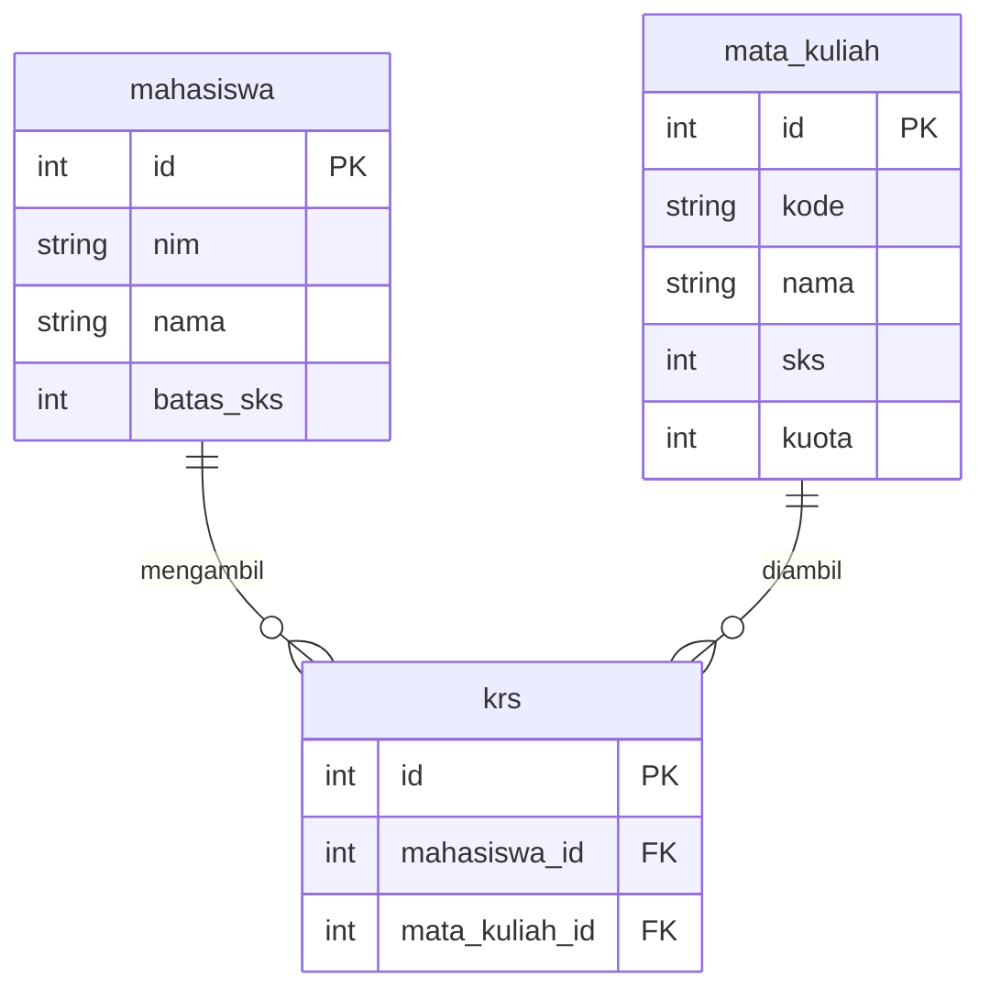

[← Bab 04 Postman](04-postman.md) · [Daftar isi](README.md) · [Bab 06 GORM →](06-gorm.md)

# Bab 05: PostgreSQL

Bab 03 berakhir dengan masalah: data hilang saat server dimatikan. Bab ini
menyelesaikannya.

Bab ini diletakkan **sebelum** GORM. GORM adalah alat untuk berbicara dengan
database; tanpa mengetahui bentuk database yang diajak bicara, perintah seperti
`AutoMigrate` sulit dipahami dan sulit diperbaiki saat error.

## Database relasional itu seperti spreadsheet

Padanannya di Excel:

| Istilah database | Padanan di Excel |
|---|---|
| **Tabel** (table) | Satu sheet |
| **Kolom** (column) | Judul kolom, menentukan jenis data |
| **Baris** (row) | Satu baris data |

Bedanya, database memaksakan aturan: kolom `sks` yang bertipe angka **menolak**
diisi teks. Aturan ini yang menjaga data tetap konsisten walau diisi banyak
pengguna.

Contoh tabel `mata_kuliah`:

| id | kode | nama | sks | kuota |
|---|---|---|---|---|
| 1 | IF2010 | Algoritma dan Pemrograman | 4 | 40 |
| 2 | IF2020 | Struktur Data | 3 | 35 |

## Tipe data yang sering dipakai

| Tipe | Untuk apa | Contoh |
|---|---|---|
| `SERIAL` | Angka yang bertambah otomatis, biasanya untuk `id` | 1, 2, 3, ... |
| `VARCHAR(n)` | Teks dengan panjang maksimum | `'IF2010'` |
| `TEXT` | Teks tanpa batas panjang | deskripsi panjang |
| `INTEGER` | Bilangan bulat | `4` |
| `BOOLEAN` | Benar / salah | `TRUE` |
| `TIMESTAMP` | Tanggal dan waktu | `2026-09-10 08:30:00` |

## Primary key

Setiap tabel butuh satu kolom yang **menjamin tiap baris unik**. Itu namanya
primary key, hampir selalu diberi nama `id`.

`nama` tidak dipakai sebagai penanda karena bisa ada dua mahasiswa bernama sama.
NIM pun bisa salah ketik lalu perlu diperbaiki. `id` yang dibuat otomatis oleh
database tidak punya masalah itu.

## Menjalankan perintah SQL

Buka **pgAdmin** → pilih database `alpro_db` → klik kanan → **Query Tool**.
Ketik perintah di panel atas, jalankan dengan tombol ▶ atau `F5`.

Alternatif lewat terminal:

```bash
psql -U postgres -d alpro_db
```

## Membuat tabel

```sql
CREATE TABLE mata_kuliah (
    id      SERIAL PRIMARY KEY,
    kode    VARCHAR(10) NOT NULL UNIQUE,
    nama    VARCHAR(100) NOT NULL,
    sks     INTEGER NOT NULL,
    kuota   INTEGER NOT NULL DEFAULT 40
);
```

Empat kata kuncinya:

| Kata kunci | Artinya |
|---|---|
| `PRIMARY KEY` | Kolom penanda unik tiap baris |
| `NOT NULL` | Wajib diisi, tidak boleh kosong |
| `UNIQUE` | Tidak boleh ada dua baris dengan nilai sama |
| `DEFAULT 40` | Kalau tidak diisi, otomatis bernilai 40 |

Aturan ini dijaga oleh **database**, bukan oleh kode Go. Data yang melanggar
tetap ditolak walaupun ada bug di program. Inilah lapisan pengaman terakhir.

## Memasukkan data: INSERT

```sql
INSERT INTO mata_kuliah (kode, nama, sks, kuota)
VALUES ('IF2010', 'Algoritma dan Pemrograman', 4, 40);
```

`id` **tidak ikut ditulis**. Karena bertipe `SERIAL`, database yang mengisinya.

Beberapa baris sekaligus:

```sql
INSERT INTO mata_kuliah (kode, nama, sks, kuota) VALUES
    ('IF2020', 'Struktur Data', 3, 35),
    ('IF2030', 'Basis Data', 3, 30),
    ('IF2040', 'Jaringan Komputer', 3, 25);
```

Teks di SQL memakai **kutip satu** (`'IF2010'`), bukan kutip dua. Kutip dua
punya arti berbeda di PostgreSQL: dipakai untuk nama kolom, bukan nilai teks.

## Membaca data: SELECT

```sql
SELECT * FROM mata_kuliah;              -- semua kolom, semua baris
SELECT kode, nama FROM mata_kuliah;     -- kolom tertentu saja
```

Menyaring dengan `WHERE`:

```sql
SELECT * FROM mata_kuliah WHERE sks = 3;
SELECT * FROM mata_kuliah WHERE sks >= 3 AND kuota > 30;
SELECT * FROM mata_kuliah WHERE nama LIKE '%Data%';   -- mengandung kata "Data"
```

Mengurutkan dan membatasi:

```sql
SELECT * FROM mata_kuliah ORDER BY sks DESC;   -- SKS terbesar dulu
SELECT * FROM mata_kuliah LIMIT 3;             -- tiga baris pertama saja
```

## Mengubah dan menghapus

```sql
UPDATE mata_kuliah SET kuota = 50 WHERE kode = 'IF2010';

DELETE FROM mata_kuliah WHERE kode = 'IF2040';
```

**`WHERE` di `UPDATE` dan `DELETE` wajib diperiksa dua kali.** Tanpa `WHERE`,
perintahnya berlaku ke **seluruh baris** di tabel. `DELETE FROM mata_kuliah;`
mengosongkan seluruh tabel tanpa konfirmasi dan tanpa cara membatalkan.

## Relasi antar tabel

Bagian ini yang menjelaskan kata "relasional".

Misalnya perlu mencatat mata kuliah yang diambil tiap mahasiswa. Cara yang salah
adalah menuliskannya di tabel mahasiswa:

| id | nama | mata_kuliah_diambil |
|---|---|---|
| 1 | Budi | IF2010, IF2020, IF2030 |

Bentuk ini menyulitkan pencarian ("siapa saja yang mengambil IF2010?"),
menyulitkan penghitungan total SKS, dan tidak mencegah kode mata kuliah yang
tidak ada.

Solusinya adalah **tabel penghubung**.



```sql
CREATE TABLE mahasiswa (
    id         SERIAL PRIMARY KEY,
    nim        VARCHAR(15) NOT NULL UNIQUE,
    nama       VARCHAR(100) NOT NULL,
    batas_sks  INTEGER NOT NULL DEFAULT 24
);

CREATE TABLE krs (
    id              SERIAL PRIMARY KEY,
    mahasiswa_id    INTEGER NOT NULL REFERENCES mahasiswa(id),
    mata_kuliah_id  INTEGER NOT NULL REFERENCES mata_kuliah(id)
);
```

`REFERENCES mahasiswa(id)` disebut **foreign key**. Efeknya nyata:

- Database **menolak** baris `krs` yang menunjuk mahasiswa tidak ada
- Database **menolak** menghapus mahasiswa yang masih punya baris di `krs`

Data yang tidak valid tidak bisa masuk, bahkan saat kode program lalai memeriksa.

Satu baris di `krs` berarti "mahasiswa ini mengambil mata kuliah itu":

```sql
INSERT INTO mahasiswa (nim, nama, batas_sks)
VALUES ('5025231001', 'Budi', 24);

INSERT INTO krs (mahasiswa_id, mata_kuliah_id) VALUES (1, 1), (1, 2);
```

## Menggabungkan tabel: JOIN

Tabel `krs` hanya berisi angka. Untuk melihat nama aslinya, gabungkan:

```sql
SELECT
    m.nama        AS mahasiswa,
    mk.kode,
    mk.nama       AS mata_kuliah,
    mk.sks
FROM krs
JOIN mahasiswa   m  ON krs.mahasiswa_id = m.id
JOIN mata_kuliah mk ON krs.mata_kuliah_id = mk.id
WHERE m.nim = '5025231001';
```

Hasilnya:

| mahasiswa | kode | mata_kuliah | sks |
|---|---|---|---|
| Budi | IF2010 | Algoritma dan Pemrograman | 4 |
| Budi | IF2020 | Struktur Data | 3 |

Menghitung total SKS yang sudah diambil. Query ini dipakai untuk aturan batas SKS
di bab 08:

```sql
SELECT SUM(mk.sks) AS total_sks
FROM krs
JOIN mata_kuliah mk ON krs.mata_kuliah_id = mk.id
WHERE krs.mahasiswa_id = 1;
```

## Kenapa SQL tetap dipelajari

Sebagian besar SQL di atas tidak ditulis manual di proyek nanti, karena GORM yang
membuatkannya dari struct Go. SQL tetap dipelajari karena tiga alasan:

1. Saat GORM berperilaku tidak sesuai harapan, SQL yang dihasilkannya perlu dibaca
   untuk mencari sebabnya
2. Ada kasus yang lebih jelas ditulis langsung dengan SQL
3. `AutoMigrate` di bab berikutnya jadi terbaca, karena `CREATE TABLE` yang
   dijalankannya sudah dikenali

---

## Ringkasan

| Perintah | Fungsi |
|---|---|
| `CREATE TABLE` | Membuat tabel beserta aturannya |
| `INSERT INTO ... VALUES` | Menambah baris |
| `SELECT ... FROM ... WHERE` | Membaca dan menyaring |
| `UPDATE ... SET ... WHERE` | Mengubah, **jangan lupa WHERE** |
| `DELETE FROM ... WHERE` | Menghapus, **jangan lupa WHERE** |
| `JOIN ... ON` | Menggabungkan tabel yang berelasi |
| `PRIMARY KEY` | Penanda unik tiap baris |
| `FOREIGN KEY` / `REFERENCES` | Menjaga relasi tetap valid |

---

[← Bab 04 Postman](04-postman.md) · [Daftar isi](README.md) · [Bab 06 GORM →](06-gorm.md)
