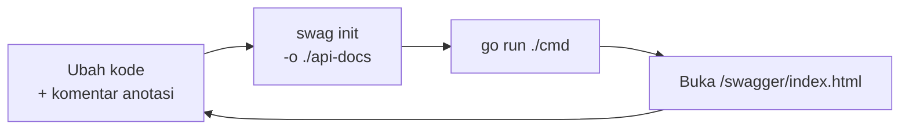

[← Bab 06 GORM](06-gorm.md) · [Daftar isi](README.md) · [Bab 08 Studi Kasus →](08-studi-kasus-krs.md)

# Bab 07: Swagger

> **Mulai bab ini kita berpindah ke proyek KRS**, yang berada di repo terpisah.
> Clone dulu kalau belum:
>
> ```bash
> git clone https://github.com/FrenaldyH/taking-course-simulation.git
> cd taking-course-simulation
> cp .env.example .env      # isi password PostgreSQL kamu
> go mod download
> ```
>
> Folder `examples/` yang dipakai bab 01-06 tidak lagi diperlukan mulai dari sini.

## Masalah yang diselesaikan

Ingat analogi menu di bab 01: API adalah daftar permintaan yang boleh diajukan.
Tapi bagaimana tim frontend tahu isi menunya?

Cara yang biasa dipakai orang, dan masalahnya:

| Cara | Masalahnya |
|---|---|
| Chat ke temanmu | Hilang tertimbun pesan lain |
| Dokumen terpisah di Google Docs | Kode berubah, dokumennya lupa diperbarui |
| Suruh baca kodenya | Frontend tidak selalu bisa membaca Go |

Semuanya bermuara ke satu masalah yang sama: **dokumentasi terpisah dari kode akan
selalu ketinggalan.**

Swagger menyelesaikannya dengan cara yang berbeda: dokumentasi ditulis sebagai
**komentar di dalam berkas kode itu sendiri**, tepat di atas fungsi yang
didokumentasikan. Saat kode berubah, komentarnya ada di depan mata.

Hasilnya berupa halaman web interaktif: bukan cuma daftar bacaan, tapi bisa
langsung dipakai mengirim request, mirip Postman tapi otomatis terisi.

## Memasang swaggo

Dua bagian yang berbeda:

```bash
# 1. Pustaka, dipakai oleh program
go get github.com/swaggo/swag github.com/swaggo/gin-swagger github.com/swaggo/files

# 2. Alat baris perintah, dipakai olehmu untuk generate
go install github.com/swaggo/swag/cmd/swag@latest
```

Verifikasi alatnya:

```bash
swag --version
```

> Kalau muncul `command not found`, folder tempat Go menaruh program hasil
> `go install` belum masuk PATH. Perbaikannya:
>
> ```bash
> export PATH="$PATH:$(go env GOPATH)/bin"
> ```
>
> Supaya menetap, tambahkan baris itu ke `~/.bashrc` atau `~/.zshrc`.
> Di Windows, tambahkan `%USERPROFILE%\go\bin` ke Environment Variables.
>
> Perintah `go install` ini juga perlu waktu, bisa beberapa menit karena
> alatnya di-compile dari sumber. Itu normal.

## Anotasi umum di main.go

Keterangan tentang API secara keseluruhan ditulis tepat di atas `func main()`:

```go
//	@title			KRS API
//	@version		1.0
//	@description	API pengisian KRS sederhana untuk modul belajar backend.
//
//	@host			localhost:8080
//	@BasePath		/
func main() {
```

| Anotasi | Isinya |
|---|---|
| `@title` | Nama API, tampil sebagai judul halaman |
| `@version` | Versi API |
| `@description` | Penjelasan; boleh ditulis beberapa baris |
| `@host` | Alamat server |
| `@BasePath` | Awalan seluruh alamat |

## Anotasi per endpoint

Ditulis tepat di atas fungsi handler-nya:

```go
//	@Summary		Ambil mata kuliah
//	@Description	Mendaftarkan mahasiswa ke sebuah mata kuliah. Ditolak jika sudah diambil, kuota penuh, atau melebihi batas SKS.
//	@Tags			krs
//	@Accept			json
//	@Produce		json
//	@Param			input	body		AmbilMataKuliahInput	true	"Mahasiswa dan mata kuliah yang dipilih"
//	@Success		201		{object}	internal_model.KRS
//	@Failure		400		{object}	internal_handler.ErrorResponse
//	@Failure		404		{object}	internal_handler.ErrorResponse
//	@Failure		409		{object}	internal_handler.ErrorResponse
//	@Router			/krs [post]
func AmbilMataKuliah(c *gin.Context) {
```

| Anotasi | Gunanya |
|---|---|
| `@Summary` | Judul singkat, tampil di daftar |
| `@Tags` | Pengelompokan endpoint |
| `@Accept` / `@Produce` | Format yang diterima / dikirim |
| `@Param` | Satu masukan: nama, letak, tipe, wajib?, keterangan |
| `@Success` / `@Failure` | Kemungkinan balasan beserta bentuk datanya |
| `@Router` | **Wajib**: alamat dan method-nya |

Letak `@Param` bisa `body`, `path` (bagian dari URL), atau `query`:

```go
//	@Param	id	path	int	true	"ID mahasiswa"
//	@Router	/mahasiswa/{id}/krs [get]
```

Perhatikan penulisan parameter di `@Router` memakai **kurung kurawal** `{id}`,
berbeda dari penulisan Gin yang memakai titik dua `:id`.

## Generate

```bash
swag init -g cmd/main.go -o ./api-docs --parseDependency --parseInternal
```

Arti tiap tanda:

| Bagian | Artinya |
|---|---|
| `-g cmd/main.go` | Berkas tempat anotasi umum berada |
| `-o ./api-docs` | Folder tempat hasilnya ditulis |
| `--parseInternal` | Ikut membaca folder `internal/` |
| `--parseDependency` | Ikut membaca tipe dari pustaka lain |

### Jebakan 1: `-o ./api-docs` wajib

Secara bawaan `swag init` menulis hasilnya ke folder **`./docs`**. Di proyek
aslinya, `docs/` dipakai untuk keperluan lain, sehingga berkas hasil generate
akan menimpanya. Sebagian besar tutorial Swagger menuliskan perintah tanpa
`-o`, sehingga bagian ini mudah terlewat.

Hasilnya tiga berkas:

```
api-docs/
  docs.go         dibaca oleh program Go
  swagger.json    format standar OpenAPI
  swagger.yaml    isi yang sama, format YAML
```

Ketiganya **hasil generate** dan tidak diedit manual, karena akan tertimpa saat
`swag init` dijalankan lagi. Yang diedit adalah komentarnya di berkas kode.

### Jebakan 2: nama tipe di dalam `internal/`

Penulisan `{object} model.KRS` akan gagal karena struct-nya berada di
`internal/model`:

```
ParseComment error: cannot find type definition: model.KRS
```

Dengan `--parseInternal`, swag memberi awalan nama foldernya:

| Salah | Benar |
|---|---|
| `model.KRS` | `internal_model.KRS` |
| `handler.ErrorResponse` | `internal_handler.ErrorResponse` |

Path lengkap seperti `github.com/nama/proyek/internal/model.KRS` juga **tidak**
bekerja. Swag memotongnya di titik pertama dan mengeluh soal `github.com`.

## Menyalakan halamannya

Di `routes/routes.go`:

```go
import (
	swaggerFiles "github.com/swaggo/files"
	ginSwagger "github.com/swaggo/gin-swagger"

	// Blank import: mendaftarkan hasil generate supaya bisa dibaca Swagger UI
	_ "github.com/FrenaldyH/taking-course-simulation/api-docs"
)

func RegisterRoutes(router *gin.Engine) {
	// ... route lain

	router.GET("/swagger/*any", ginSwagger.WrapHandler(swaggerFiles.Handler))
}
```

Tanda `_` di depan import artinya "muat berkas ini, tapi aku tidak memakai namanya
secara langsung". Yang dibutuhkan hanyalah efek sampingnya: berkas `docs.go`
mendaftarkan dirinya sendiri saat dimuat.

## Membukanya

```bash
go run ./cmd
```

Buka http://localhost:8080/swagger/index.html

Isi halamannya:

- Seluruh endpoint dikelompokkan per `@Tags`
- Klik salah satu untuk melihat parameter dan kemungkinan balasannya
- Tombol **Try it out** untuk mengirim request langsung dari halaman itu
- Bentuk data tiap model, di bagian **Schemas** paling bawah

Tombol **Try it out** membedakan Swagger dari dokumen biasa: API bisa dicoba
tanpa memasang alat apa pun, termasuk tanpa Postman.

Alamat lain yang berguna: http://localhost:8080/swagger/doc.json berisi
dokumentasi mentah dalam format OpenAPI. Banyak alat lain bisa mengimpornya,
termasuk Postman, sehingga koleksi request bisa dibuat otomatis.

## Alur kerjanya



Mengubah komentar saja tidak cukup. Halaman Swagger membaca berkas hasil
generate, jadi setiap kali anotasi berubah, `swag init` harus dijalankan ulang.
Ini penyebab paling umum perubahan tidak muncul di halaman.

## Swagger dan Postman

Keduanya dipakai bersamaan, bukan saling menggantikan:

| | Swagger | Postman |
|---|---|---|
| Sumber isinya | Otomatis dari komentar di kode | Disusun manual |
| Selalu sesuai kode? | Ya, selama rutin di-generate | Tidak, harus dirawat manual |
| Menyimpan skenario uji | Tidak | Ya |
| Untuk siapa | Pengguna API | Pengembang API |

Ringkasnya: **Postman untuk mengembangkan, Swagger untuk menyerahkan.**

---

## Ringkasan

| Hal | Intinya |
|---|---|
| Kenapa Swagger | Dokumentasi menempel di kode, jadi tidak basi |
| Pasang | `go get` pustakanya + `go install` alat `swag` |
| Anotasi umum | Di atas `func main()` |
| Anotasi endpoint | Di atas tiap handler; `@Router` wajib |
| Generate | `swag init -g cmd/main.go -o ./api-docs --parseDependency --parseInternal` |
| **Jebakan 1** | Tanpa `-o`, hasilnya menimpa folder `docs/` |
| **Jebakan 2** | Tipe di `internal/` ditulis `internal_model.KRS`, bukan `model.KRS` |
| Halamannya | http://localhost:8080/swagger/index.html |
| Ingat | Setiap ubah anotasi, jalankan `swag init` lagi |

---

[← Bab 06 GORM](06-gorm.md) · [Daftar isi](README.md) · [Bab 08 Studi Kasus →](08-studi-kasus-krs.md)
