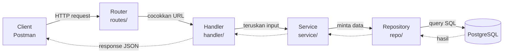
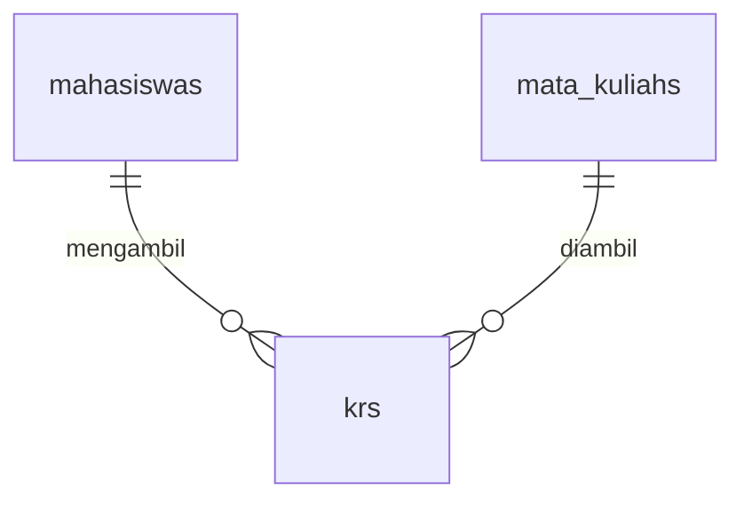

[← Bab 07 Swagger](07-swagger.md) · [Daftar isi](README.md)

# Bab 08: Studi Kasus Sistem KRS

Sampai bab 07, semua contoh berdiri sendiri dalam satu berkas. Itu bagus untuk
belajar satu hal pada satu waktu, tapi bukan begitu cara proyek nyata ditulis.

Bab ini membedah proyek yang sudah jadi: **API pengisian KRS**.

> Kodenya ada di repo
> [taking-course-simulation](https://github.com/FrenaldyH/taking-course-simulation).
> Buka di VS Code sambil membaca bab ini, penjelasannya menunjuk berkas
> demi berkas. Kalau belum di-clone, langkahnya ada di [bab 07](07-swagger.md).

## Apa yang dilakukan sistem ini

Mahasiswa memilih mata kuliah, dengan tiga aturan:

1. Tidak boleh mengambil mata kuliah yang sama dua kali
2. Kuota kelas tidak boleh terlampaui
3. Total SKS tidak boleh melebihi batas SKS mahasiswa

Aturan ketiga itulah alasan proyek ini dipilih sebagai contoh. Pada CRUD biasa,
program hanya menyimpan apa yang dikirim. Di sini program harus **memutuskan**,
dan keputusan itu perlu tempat tinggal yang jelas.

## Kenapa kodenya dipecah ke banyak folder?

Contoh `04-gin-crud` menaruh semuanya dalam satu berkas. Untuk lima endpoint itu
masih terbaca. Tapi bayangkan setelah 20 fitur:

| Semua di satu berkas | Dipisah per peran |
|---|---|
| Awalnya lebih cepat ditulis | Awalnya terasa lebih lambat |
| Setelah 20 fitur jadi ribuan baris | Tiap berkas tetap pendek |
| Query database tersebar di mana-mana | Semua query ada di satu tempat |
| Ganti PostgreSQL ke MySQL berarti menyisir seluruh berkas | Cukup ubah folder `repo/` |

Kembali ke analogi restoran di bab 01, dapur yang rapi membagi tugas:

| Peran di restoran | Folder | Tugasnya |
|---|---|---|
| **Pelayan** | `internal/handler/` | Menerima pesanan, mengantar hasil. Tidak ikut memasak |
| **Koki** | `internal/service/` | Mengolah, memutuskan, menolak pesanan yang melanggar aturan |
| **Petugas gudang** | `internal/repo/` | Satu-satunya yang boleh masuk gudang |
| **Kartu resep** | `internal/model/` | Menjelaskan bentuk data |

## Perjalanan satu request



Aturan mainnya: **request bergerak satu arah dan tidak boleh melompat.** Handler
tidak pernah menyentuh database langsung, sama seperti pelanggan tidak menyerbu
gudang.

Aturan ini bisa dibuktikan, bukan sekadar diyakini. Jalankan:

```bash
grep -rl "gorm.io" --include="*.go" .
```

Keluarannya hanya berkas di `config/` dan `internal/repo/`. Kalau suatu hari nama
berkas di folder lain ikut muncul, berarti aturannya sudah bocor.

## Struktur folder

```
cmd/main.go              Menyalakan semuanya
routes/routes.go         Daftar seluruh alamat
internal/
  handler/               Lapisan HTTP
    response.go          Bentuk error + pemetaan status code
    krs_handler.go
    mata_kuliah_handler.go
  service/
    krs_service.go       Tiga aturan bisnis ada di sini
  repo/
    errors.go
    krs_repo.go
    mahasiswa_repo.go
    mata_kuliah_repo.go
  model/
    mahasiswa.go
    mata_kuliah.go
    krs.go
config/
  database.go            Koneksi PostgreSQL
  seed.go                Data contoh saat pertama jalan
```

## Model: tiga tabel



`internal/model/krs.go` adalah yang paling menarik:

```go
type KRS struct {
	ID           uint `json:"id" gorm:"primaryKey"`
	MahasiswaID  uint `json:"mahasiswa_id" gorm:"not null;index"`
	MataKuliahID uint `json:"mata_kuliah_id" gorm:"not null;index"`

	Mahasiswa  *Mahasiswa  `json:"mahasiswa,omitempty" gorm:"foreignKey:MahasiswaID"`
	MataKuliah *MataKuliah `json:"mata_kuliah,omitempty" gorm:"foreignKey:MataKuliahID"`

	CreatedAt time.Time `json:"created_at"`
}

func (KRS) TableName() string {
	return "krs"
}
```

Tiga hal yang perlu diperhatikan:

- Dua field `...ID` adalah **kolom sungguhan** di database
- Dua field di bawahnya **bukan kolom**: itu tempat GORM menaruh data relasi saat
  `Preload` dipakai (bab 06). Bentuknya pointer dengan `omitempty` supaya hilang
  dari JSON kalau tidak dimuat, bukan tampil sebagai objek kosong
- `TableName()` mengunci nama tabel jadi `krs`. Tanpa ini GORM akan menebak bentuk
  jamak dari akronim KRS, sementara ada query SQL langsung yang menyebut `krs`
  secara harfiah

## Repository: satu-satunya yang menyentuh database

Sebagian besar isinya pendek dan langsung. Yang menarik ada dua.

**Menerjemahkan error GORM**, supaya lapisan lain tidak perlu mengenal GORM:

```go
func FindMahasiswaByID(id uint) (model.Mahasiswa, error) {
	var mahasiswa model.Mahasiswa

	err := config.DB.First(&mahasiswa, id).Error
	if errors.Is(err, gorm.ErrRecordNotFound) {
		return model.Mahasiswa{}, ErrNotFound
	}

	return mahasiswa, err
}
```

**Menghitung total SKS dengan SQL langsung**, karena lebih jelas daripada dirangkai
lewat ORM:

```go
func TotalSKSDiambil(mahasiswaID uint) (int, error) {
	var total int

	err := config.DB.Raw(`
		SELECT COALESCE(SUM(mk.sks), 0)
		FROM krs
		JOIN mata_kuliahs mk ON krs.mata_kuliah_id = mk.id
		WHERE krs.mahasiswa_id = ?`, mahasiswaID).Scan(&total).Error

	return total, err
}
```

Query ini sama dengan yang ada di bab 05. `COALESCE` mengubah hasil `NULL`,
yaitu mahasiswa yang belum mengambil apa pun, menjadi `0`.

## Service: tempat aturan tinggal

Inilah inti proyek ini. Perhatikan urutan pemeriksaannya:

```go
func AmbilMataKuliah(mahasiswaID, mataKuliahID uint) (model.KRS, error) {
	mahasiswa, err := repo.FindMahasiswaByID(mahasiswaID)
	// ... 404 kalau tidak ada

	mataKuliah, err := repo.FindMataKuliahByID(mataKuliahID)
	// ... 404 kalau tidak ada

	// Aturan 1: paling sering terjadi, jadi diperiksa duluan
	sudah, err := repo.KRSExists(mahasiswaID, mataKuliahID)
	if sudah {
		return model.KRS{}, ErrSudahDiambil
	}

	// Aturan 2: kuota
	peserta, err := repo.CountPeserta(mataKuliahID)
	if peserta >= mataKuliah.Kuota {
		return model.KRS{}, fmt.Errorf("%w (%d dari %d kursi terisi)",
			ErrKuotaPenuh, peserta, mataKuliah.Kuota)
	}

	// Aturan 3: batas SKS
	totalSKS, err := repo.TotalSKSDiambil(mahasiswaID)
	if totalSKS+mataKuliah.SKS > mahasiswa.BatasSKS {
		return model.KRS{}, fmt.Errorf("%w: sudah %d SKS, menambah %d SKS, batas %d SKS",
			ErrMelebihiBatasSKS, totalSKS, mataKuliah.SKS, mahasiswa.BatasSKS)
	}

	krs := model.KRS{MahasiswaID: mahasiswaID, MataKuliahID: mataKuliahID}
	if err := repo.CreateKRS(&krs); err != nil {
		return model.KRS{}, err
	}

	krs.MataKuliah = &mataKuliah
	return krs, nil
}
```

Tiga hal yang layak dicermati:

**Tidak ada satu pun `c.JSON` di sini.** Service tidak tahu-menahu soal HTTP. Kalau
suatu hari aplikasi ini juga dipakai lewat aplikasi terminal atau antrean pesan,
seluruh aturan ini tetap terpakai tanpa diubah.

**`%w` bukan `%v`.** Kata kerja `%w` membungkus error asli, sehingga `errors.Is`
di handler tetap mengenali jenisnya walau pesannya sudah ditambahi angka.

**Urutan pemeriksaan disengaja.** Kesalahan yang paling sering dilakukan pengguna
diperiksa lebih dulu, supaya pesan errornya yang paling relevan yang muncul.

## Handler: menerjemahkan error jadi status code

Seluruh pemetaan error ke status code ditaruh di satu tempat,
`internal/handler/response.go`:

```go
func respondError(c *gin.Context, err error) {
	switch {
	case errors.Is(err, service.ErrMahasiswaTidakAda),
		errors.Is(err, service.ErrMataKuliahTidakAda),
		errors.Is(err, service.ErrKRSTidakAda):
		c.JSON(http.StatusNotFound, ErrorResponse{Error: err.Error()})

	case errors.Is(err, service.ErrSudahDiambil),
		errors.Is(err, service.ErrKuotaPenuh),
		errors.Is(err, service.ErrMelebihiBatasSKS):
		c.JSON(http.StatusConflict, ErrorResponse{Error: err.Error()})

	default:
		c.JSON(http.StatusInternalServerError, ErrorResponse{Error: err.Error()})
	}
}
```

### Status code baru: 409 Conflict

Bab 01 memperkenalkan `400` dan `404`. Ketiga pelanggaran aturan di atas
memakai `409 Conflict`, dan bedanya penting:

| Status | Artinya | Contoh di sini |
|---|---|---|
| `400` | Kiriman **salah bentuk** | `mahasiswa_id` tidak diisi |
| `404` | Yang dicari **tidak ada** | mahasiswa dengan id 999 |
| `409` | Kiriman **benar**, tapi keadaan saat ini tidak mengizinkan | kuota sudah penuh |

Permintaan "ambil IF2040" bentuknya benar dan datanya ada. Yang menghalangi adalah
keadaan: kursinya sudah habis. Itu bukan `400`, dan bukan salah pengguna
menuliskannya.

## Menjalankan proyek

```bash
cp .env.example .env      # isi password PostgreSQL kamu
go run ./cmd
```

Saat pertama dijalankan, program akan:

1. Menyambung ke PostgreSQL
2. Membuat tabel `mahasiswa`, `mata_kuliahs`, `krs` lewat `AutoMigrate`
3. Mengisi data contoh: 7 mata kuliah, 3 mahasiswa

```
Database connected successfully
Data contoh dimasukkan: 7 mata kuliah, 3 mahasiswa
Server jalan di http://localhost:8080
```

Dua data contoh sengaja dibuat mudah diuji:

- **IF2040** kuotanya hanya **2 kursi**: supaya aturan kuota gampang dipicu
- **Andi Wijaya** (id 3) batas SKS-nya hanya **12**: supaya aturan batas SKS
  gampang dipicu

## Mencoba di Postman

| # | Request | Hasil |
|---|---|---|
| 1 | `GET /mata-kuliah` | 7 mata kuliah |
| 2 | `POST /krs` body `{"mahasiswa_id":1,"mata_kuliah_id":1}` | `201` |
| 3 | Ulangi request nomor 2 | `409`: `mata kuliah ini sudah diambil` |
| 4 | `GET /mahasiswa/1/krs` | KRS Budi, lengkap dengan detail mata kuliahnya |
| 5 | `DELETE /krs/1` | `200`: `mata kuliah berhasil dibatalkan` |

Memicu aturan kuota:

```
POST /krs  {"mahasiswa_id":1,"mata_kuliah_id":4}   -> 201  (kursi 1 dari 2)
POST /krs  {"mahasiswa_id":2,"mata_kuliah_id":4}   -> 201  (kursi 2 dari 2)
POST /krs  {"mahasiswa_id":3,"mata_kuliah_id":4}   -> 409  kuota mata kuliah sudah penuh (2 dari 2 kursi terisi)
```

Memicu aturan batas SKS dengan Andi (batas 12 SKS):

```
POST /krs  {"mahasiswa_id":3,"mata_kuliah_id":1}   -> 201  (4 SKS,  total 4)
POST /krs  {"mahasiswa_id":3,"mata_kuliah_id":5}   -> 201  (4 SKS,  total 8)
POST /krs  {"mahasiswa_id":3,"mata_kuliah_id":2}   -> 201  (3 SKS,  total 11)
POST /krs  {"mahasiswa_id":3,"mata_kuliah_id":3}   -> 409  melebihi batas SKS: sudah 11 SKS, menambah 3 SKS, batas 12 SKS
```

---

# Menambah satu fitur baru

Bagian ini menelusuri fitur `DELETE /krs/:id` yang sudah ada di proyek, lapis
demi lapis.

Urutannya selalu **dari dalam ke luar**: model → repository → service → handler →
route. Tiap lapisan memanggil lapisan di dalamnya, jadi yang dipanggil harus ada
lebih dulu.

## Langkah 1: Model

Tidak ada yang perlu ditambah. Menghapus baris KRS memakai struct `KRS` yang sudah
ada.

> Kalau fiturmu butuh data yang belum tersimpan, **di sinilah** field baru
> ditambahkan, lalu `AutoMigrate` akan menambahkan kolomnya saat server dijalankan
> ulang.

## Langkah 2: Repository

`internal/repo/krs_repo.go`:

```go
func DeleteKRS(id uint) error {
	hasil := config.DB.Delete(&model.KRS{}, id)
	if hasil.Error != nil {
		return hasil.Error
	}

	if hasil.RowsAffected == 0 {
		return ErrNotFound
	}

	return nil
}
```

Sesuai catatan di bab 06, menghapus baris yang tidak ada **bukan error** bagi
GORM. Tanpa pemeriksaan `RowsAffected`, penghapusan id yang tidak ada akan
dibalas `200 berhasil` padahal tidak ada yang terhapus.

## Langkah 3: Service

`internal/service/krs_service.go`:

```go
func BatalkanKRS(id uint) error {
	err := repo.DeleteKRS(id)
	if errors.Is(err, repo.ErrNotFound) {
		return ErrKRSTidakAda
	}

	return err
}
```

Fungsinya pendek karena pembatalan tidak punya aturan bisnis. Lapisan ini tetap
dibuat agar aturan yang muncul kemudian, misalnya "tidak boleh membatalkan
setelah masa KRS ditutup", punya tempat yang jelas. Kalau handler memanggil
repository langsung, aturan seperti itu akan menyelinap ke lapisan HTTP.

## Langkah 4: Handler

`internal/handler/krs_handler.go`:

```go
func BatalkanKRS(c *gin.Context) {
	krsID, ok := parseID(c, "id")
	if !ok {
		return
	}

	if err := service.BatalkanKRS(krsID); err != nil {
		respondError(c, err)
		return
	}

	c.JSON(http.StatusOK, MessageResponse{Message: "mata kuliah berhasil dibatalkan"})
}
```

Handler hanya mengerjakan tiga hal: membaca masukan, memanggil service,
menerjemahkan hasilnya jadi HTTP. Tidak ada aturan bisnis, tidak ada query.

Karena `ErrKRSTidakAda` sudah terdaftar di `respondError`, statusnya otomatis
menjadi `404` tanpa perlu ditulis ulang di sini.

## Langkah 5: Route

`routes/routes.go`:

```go
router.DELETE("/krs/:id", handler.BatalkanKRS)
```

Satu baris. Fiturnya selesai.

## Langkah 6: Pengujian

```bash
go run ./cmd
```

```
DELETE /krs/1      -> 200  {"message":"mata kuliah berhasil dibatalkan"}
DELETE /krs/1      -> 404  {"error":"data KRS tidak ditemukan"}   (sudah terhapus)
DELETE /krs/9999   -> 404  {"error":"data KRS tidak ditemukan"}
DELETE /krs/abc    -> 400  {"error":"id harus berupa angka"}
```

## Pola yang berulang

| Langkah | Berkas | Pertanyaan yang dijawab |
|---|---|---|
| 1 | `internal/model/` | Apakah butuh data baru? |
| 2 | `internal/repo/` | Bagaimana mengambil/menyimpannya di database? |
| 3 | `internal/service/` | Aturan apa yang berlaku? |
| 4 | `internal/handler/` | Apa masukannya, dan apa balasannya? |
| 5 | `routes/routes.go` | Alamatnya apa? |

Setiap penambahan fitur menjawab lima pertanyaan itu berurutan. Jawaban yang
jatuh ke lapisan yang salah, misalnya aturan bisnis tertulis di handler,
menandakan ada yang perlu dipindahkan.

---

## Ringkasan

- Kode dipecah per peran supaya tetap terkelola saat proyek membesar
- Request mengalir satu arah: **Router → Handler → Service → Repository → Database**
- **Service** tempat aturan bisnis; ia tidak tahu-menahu soal HTTP
- **Repository** satu-satunya yang mengenal GORM, bisa dibuktikan dengan `grep`
- **Handler** hanya menerjemahkan HTTP, tidak memutuskan apa pun
- `409 Conflict` untuk permintaan yang benar tapi terhalang keadaan
- Menambah fitur: kerjakan dari dalam ke luar, model → route

---

[← Bab 07 Swagger](07-swagger.md) · [Daftar isi](README.md)
