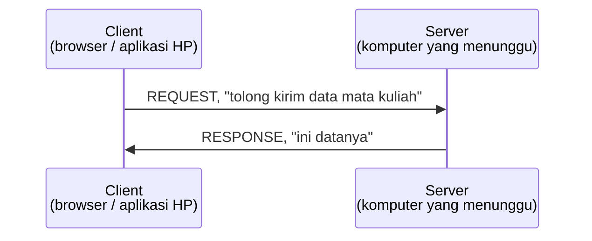
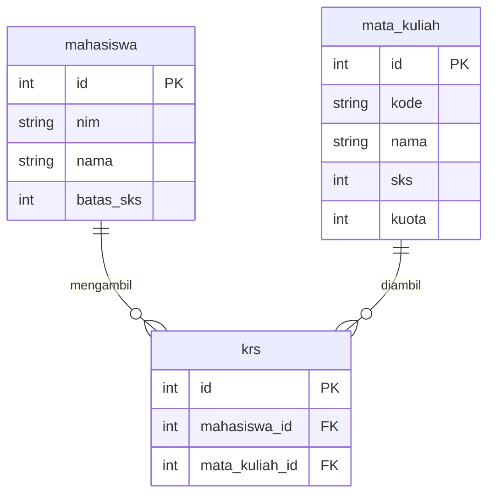
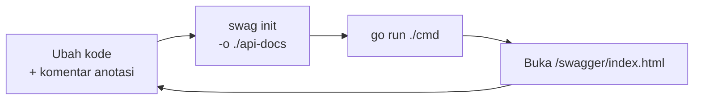
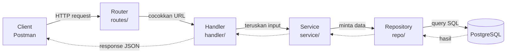
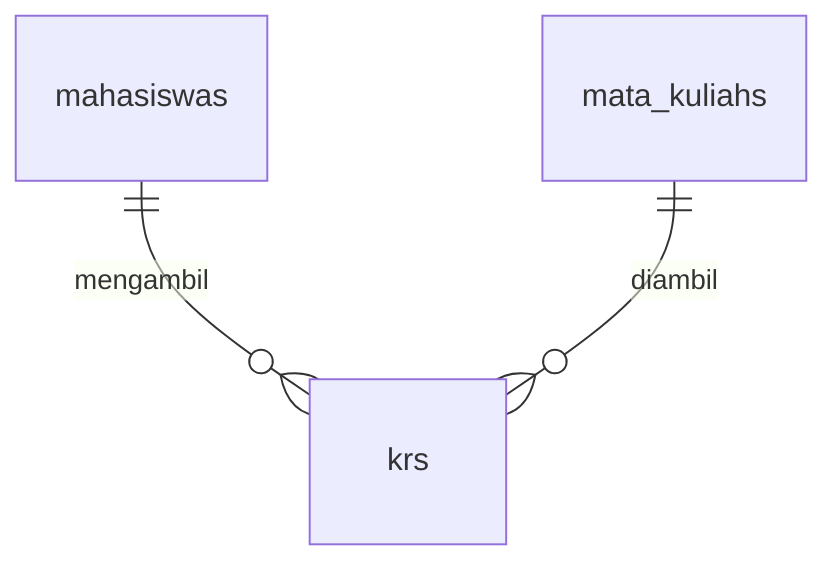

# Modul Backend dengan Go, Gin, dan GORM

Modul belajar backend untuk mahasiswa yang sudah paham logika pemrograman, tapi
belum pernah menyentuh backend, terminal, atau bahasa Go.

Dibaca berurutan dari Bab 00. Tiap bab menumpuk di atas bab sebelumnya, dan
istilah baru dijelaskan saat pertama kali muncul.

## Daftar Isi

| Bab | Isi | Perkiraan baca |
|---|---|---|
| [Bab 00: Persiapan](#bab-00-persiapan) | Instalasi Go, PostgreSQL, VS Code, Postman | 45 menit, kerjakan sebelum kelas |
| [Bab 01: Backend Dasar](#bab-01-backend-dasar) | Client, server, HTTP, API, JSON | 20 menit |
| [Bab 02: Go Dasar](#bab-02-go-dasar) | Sintaks Go seperlunya untuk backend | 30 menit |
| [Bab 03: Gin](#bab-03-gin) | Web server, routing, handler | 30 menit |
| [Bab 04: Postman](#bab-04-postman) | Menguji API: POST, PUT, DELETE | 15 menit |
| [Bab 05: PostgreSQL](#bab-05-postgresql) | Database relasional, tabel, SQL dasar | 25 menit |
| [Bab 06: GORM](#bab-06-gorm) | Menyambungkan Go ke database | 35 menit |
| [Bab 07: Swagger](#bab-07-swagger) | Dokumentasi API otomatis | 20 menit |
| [Bab 08: Studi Kasus Sistem KRS](#bab-08-studi-kasus-sistem-krs) | Bedah proyek nyata dan menambah fitur | 40 menit |
| [Lampiran A: Cheat Sheet Terminal](#lampiran-a-cheat-sheet-terminal) | Referensi perintah | |
| [Lampiran B: Latihan Mandiri](#lampiran-b-latihan-mandiri) | Contoh kode dan proyek yang bisa diunduh | |

Dua urutan yang sengaja dipilih:

**Postman ditaruh setelah Gin.** Browser hanya bisa mengirim request GET. Begitu
endpoint yang menerima data (POST) dibuat, browser tidak lagi cukup.

**PostgreSQL ditaruh sebelum GORM.** GORM adalah alat untuk berbicara dengan
database. Tanpa mengetahui bentuk database yang diajak bicara, perintah seperti
`AutoMigrate` sulit dipahami dan sulit diperbaiki saat error.

---

## Bab 00: Persiapan

Bab ini dikerjakan sebelum kelas dimulai, karena seluruhnya berupa instalasi.

| Alat | Gunanya |
|---|---|
| **Go** | Bahasa yang kita pakai menulis backend |
| **VS Code** | Tempat menulis kode |
| **PostgreSQL** | Database, tempat data disimpan permanen |
| **Postman** | Alat untuk menguji API yang kita buat |

### 1. Install Go

**Windows**

1. Unduh installer dari https://go.dev/dl/ (pilih berkas `.msi`)
2. Jalankan installer, klik Next sampai selesai
3. **Tutup semua terminal / PowerShell yang sedang terbuka**, lalu buka yang baru

**macOS**

1. Unduh berkas `.pkg` dari https://go.dev/dl/
2. Jalankan installer sampai selesai

**Linux (Ubuntu/Debian)**

```bash
sudo apt update && sudo apt install golang-go
```

#### Verifikasi

Buka terminal, ketik:

```bash
go version
```

Keluarannya berupa nomor versi, misalnya:

```
go version go1.25.0 linux/amd64
```

Kalau muncul `'go' is not recognized` atau `command not found`, terminalnya belum
memuat PATH yang baru. Tutup semua jendela terminal, buka yang baru, lalu ulangi.

### 2. Install VS Code dan Extension Go

1. Unduh VS Code: https://code.visualstudio.com/
2. Buka VS Code, tekan `Ctrl+Shift+X` (Mac: `Cmd+Shift+X`)
3. Cari **"Go"**, pasang extension resmi dari **Go Team at Google**
4. Buat berkas baru bernama `coba.go`, ketik `package main`
5. Kalau muncul notifikasi meminta memasang tools tambahan, klik **Install All**

Extension ini memberi tahu kesalahan ketik sebelum kode dijalankan.

#### Verifikasi

Berkas `.go` yang dibuka punya pewarnaan sintaks: kata `package` berwarna berbeda
dari kata `main`.

### 3. Install PostgreSQL

**Windows / macOS**

1. Unduh dari https://www.postgresql.org/download/
2. Jalankan installer
3. **CATAT PASSWORD yang kamu buat.** Jangan sampai lupa
4. Port biarkan bawaan: `5432`
5. Sertakan **pgAdmin** saat instalasi (biasanya sudah tercentang)

**Linux (Ubuntu/Debian)**

```bash
sudo apt update && sudo apt install postgresql
sudo systemctl start postgresql
sudo -u postgres psql -c "ALTER USER postgres PASSWORD 'postgres';"
```

#### Buat satu database kosong

Lewat pgAdmin: login dengan password tadi, klik kanan `Databases`, pilih `Create`,
lalu `Database`, beri nama **`alpro_db`**, Save.

Lewat terminal:

```bash
psql -U postgres -c "CREATE DATABASE alpro_db;"
```

#### Verifikasi

Database `alpro_db` muncul di daftar sebelah kiri pgAdmin.

#### Kalau error

| Pesan | Artinya | Perbaikan |
|---|---|---|
| `connection refused` | Layanan PostgreSQL belum jalan | Windows: buka `services.msc`, cari `postgresql`, klik Start. Linux: `sudo systemctl start postgresql` |
| `password authentication failed` | Password salah | Ulangi instalasi atau reset password |
| `port 5432 already in use` | Sudah ada PostgreSQL lain terpasang | Pakai yang sudah ada, tidak perlu pasang dua |

### 4. Install Postman

Unduh di https://www.postman.com/downloads/

Postman dipakai untuk mengirim request ke API buatan kita. Browser hanya bisa
mengirim request jenis GET, sedangkan nanti kita perlu mengirim data baru (POST),
mengubah (PUT), dan menghapus (DELETE). Penjelasan lengkapnya ada di
[Bab 04](#bab-04-postman).

Saat pertama dibuka, Postman menawarkan pembuatan akun. Untuk keperluan modul ini
akun **tidak diperlukan**: cari tautan kecil bertuliskan "Skip and go to the app"
atau semacamnya.

### 5. Ambil contoh kode

Langkah ini opsional. Seluruh kode yang dibahas ditulis lengkap di dalam modul,
tapi contoh yang bisa langsung dijalankan tersedia sebagai paket terpisah. Alamat
unduhannya ada di [Lampiran B](#lampiran-b-latihan-mandiri).

Setelah paketnya diekstrak, masuk ke foldernya lalu:

```bash
go mod download
```

Lalu buat berkas `.env` dari templatnya:

```bash
cp .env.example .env
```

> Windows PowerShell memakai: `copy .env.example .env`

Buka berkas `.env` di VS Code, ganti `your_password_here` dengan password
PostgreSQL kamu.

#### Verifikasi akhir

```bash
go run ./examples/01-hello
```

Harus muncul:

```
Nama : Budi
NIM  : 5025231001
SKS  : 20
Lulus: true
```

diikuti beberapa baris lagi.

Keluaran itu menandakan instalasi sudah benar: Go terpasang, pustaka terunduh, dan
program Go bisa dijalankan dari terminal.

---

## Bab 01: Backend Dasar

Bab ini tidak memuat kode. Isinya istilah dasar yang dipakai di bab berikutnya.

### Analogi restoran

Analogi ini dipakai berulang sampai bab terakhir.

| Bagian restoran | Padanannya |
|---|---|
| **Ruang makan**: tempat pelanggan duduk, membaca menu, memesan | **Frontend**: yang dilihat dan disentuh pengguna |
| **Dapur**: menerima pesanan, mengolah, mengirim hasil keluar | **Backend**: yang memproses, tidak terlihat pengguna |
| **Gudang bahan**: menyimpan bahan, isinya tetap ada walau restoran tutup | **Database**: menyimpan data secara permanen |

Aturan pentingnya: **pelanggan tidak pernah masuk ke dapur, dan tidak pernah
mengambil sendiri bahan dari gudang.** Semua permintaan lewat pelayan.

Aturan itu yang nanti menjelaskan kenapa kode backend dipecah ke banyak folder
(Bab 08), dan kenapa frontend tidak boleh mengakses database secara langsung.

### Client dan Server

Setiap kali aplikasi dibuka, ada dua pihak yang berkirim pesan.



**Client selalu yang memulai percakapan.** Server tidak pernah mengirim apa pun
lebih dulu; ia menunggu, lalu menjawab.

Karena itu server harus terus menyala. Saat `go run` dijalankan, terminal tidak
kembali ke prompt: server sedang menunggu request, bukan hang. Hentikan dengan
`Ctrl+C`.

### Isi sebuah request

Request berisi tiga hal:

| Bagian | Pertanyaan yang dijawab | Contoh |
|---|---|---|
| **Method** | Mau melakukan apa? | `POST` |
| **URL** | Ke bagian mana? | `/mata-kuliah` |
| **Body** | Data apa yang dibawa? | `{"kode": "IF2010", "nama": "Alpro"}` |

Response berisi dua hal:

| Bagian | Pertanyaan yang dijawab | Contoh |
|---|---|---|
| **Status** | Berhasil atau tidak? | `201` |
| **Body** | Data apa yang dikembalikan? | `{"id": 1, "kode": "IF2010"}` |

#### Melihat request asli

Tanpa menulis kode:

1. Buka website apa saja di browser
2. Tekan `F12` untuk membuka DevTools
3. Pilih tab **Network**
4. Refresh halamannya
5. Klik salah satu baris yang muncul

Panel yang muncul menampilkan Method, URL, Status, dan Response body, sesuai
tabel di atas.

### Empat kata kerja

Method adalah niat dari sebuah request. Hampir semua yang dilakukan aplikasi
jatuh ke salah satu dari empat ini:

| Method | Artinya | Di restoran | Istilah CRUD |
|---|---|---|---|
| `GET` | Ambil atau lihat data | Lihat menu | **R**ead |
| `POST` | Kirim data baru | Pesan makanan | **C**reate |
| `PUT` | Ubah data yang sudah ada | Ganti pesanan | **U**pdate |
| `DELETE` | Hapus data | Batalkan pesanan | **D**elete |

**CRUD** = Create, Read, Update, Delete. Keempat operasi ini ditulis kodenya
mulai Bab 03.

### Angka jawaban server

Setiap response membawa satu angka yang meringkas hasilnya. Kelompok angkanya
sudah menjelaskan banyak:

| Kelompok | Artinya | Contoh yang sering muncul |
|---|---|---|
| **2xx** | Berhasil | `200` OK: permintaan sukses; `201` Created: data baru terbuat |
| **4xx** | Salah di sisi **client** | `400` Bad Request: data kiriman tidak valid; `404` Not Found: alamatnya tidak ada |
| **5xx** | Salah di sisi **server** | `500` Internal Server Error: kode kita yang bermasalah |

**4xx berarti kiriman client salah, 5xx berarti kode server bermasalah.** Angka
ini menunjukkan di sisi mana kesalahan harus dicari.

`404` saat menjalankan server sendiri bukan berarti gagal. Server hidup dan
menjawab, hanya saja alamat yang dibuka belum dibuat.

### API

API adalah daftar permintaan yang boleh diajukan ke sebuah server. Seperti menu
di restoran.

| Menu memberi tahu | API memberi tahu |
|---|---|
| Apa saja yang bisa dipesan | Alamat apa saja yang tersedia |
| Bagaimana cara memesannya | Method dan data apa yang harus dikirim |
| Apa yang akan diterima | Response seperti apa yang dibalas |

Yang **tidak** diberitahukan: menu tidak memuat cara memasak, API tidak memuat
isi kode.

Dengan adanya API, tim frontend dan backend bisa bekerja terpisah setelah
menyepakati kontraknya. Aplikasi cuaca di ponsel tidak punya alat ukur suhu; ia
memanggil API penyedia data cuaca.

### JSON

Format yang dipakai untuk menulis data yang dikirim bolak-balik. Bentuknya
seperti ini:

```json
{
  "id": 1,
  "kode": "IF2010",
  "nama": "Algoritma dan Pemrograman",
  "sks": 4,
  "tersedia": true
}
```

Aturannya:

- Data ditulis berpasangan `"nama": nilai`
- Nama selalu diapit tanda kutip ganda
- Nilai bisa berupa teks (`"Alpro"`), angka (`4`), benar/salah (`true`), atau
  daftar (`[...]`)
- Antar pasangan dipisah koma, dan **tidak ada koma setelah pasangan terakhir**

Koma berlebih di akhir adalah penyebab error JSON paling sering. Periksa itu
lebih dulu saat Postman menolak JSON.

Daftar beberapa data ditulis dalam kurung siku:

```json
[
  { "id": 1, "kode": "IF2010" },
  { "id": 2, "kode": "IF2020" }
]
```

### Kenapa perlu database

Data bisa saja disimpan di variabel program. Perbandingannya:

| Disimpan di variabel | Disimpan di database |
|---|---|
| Data hidup di memori (RAM) selama program berjalan | Data ditulis ke penyimpanan permanen di luar program |
| Server dimatikan, **semua data hilang** | Server dimatikan, **data tetap aman** |

Istilahnya **persistence**.

Bab 03 sengaja menyimpan data di variabel lebih dulu, agar masalahnya terlihat
langsung: matikan server, jalankan lagi, datanya hilang.

### Ringkasan

- Backend adalah dapur: memproses permintaan, tidak terlihat pengguna
- Client selalu memulai, server menunggu dan menjawab
- Request berisi **method + URL + body**; response berisi **status + body**
- Empat method utama: `GET` `POST` `PUT` `DELETE`, dikenal sebagai CRUD
- Status `2xx` berhasil, `4xx` salah kirim dari client, `5xx` kode server bermasalah
- API adalah daftar permintaan yang boleh diajukan, seperti menu
- JSON adalah format datanya; hati-hati koma berlebih
- Database dipakai supaya data tidak hilang saat server mati

---

## Bab 02: Go Dasar

Bab ini **bukan** kursus Go lengkap. Isinya hanya bagian yang benar-benar dipakai
di Bab 03 sampai 08.

Logika dasar seperti `if` dan perulangan sengaja dilewati. Fokusnya pada hal yang
**berbeda** dari bahasa lain: struct, cara Go menangani error, dan pointer.

### Struktur file Go paling minimal

```go
package main

import "fmt"

func main() {
	fmt.Println("Halo")
}
```

Tiga hal wajib:

- `package main`: menandakan berkas ini program yang bisa dijalankan
  (bukan pustaka yang dipakai program lain)
- `import`: daftar pustaka yang dipakai; `fmt` adalah pustaka bawaan untuk
  menulis ke layar
- `func main()`: titik mulai program. Selalu dari sini

Jalankan dengan:

```bash
go run nama_file.go
```

Go **menolak** meng-compile kalau ada `import` yang tidak dipakai. Extension Go
di VS Code membereskannya otomatis saat berkas disimpan.

### Variabel dan tipe statis

Contoh yang dibahas di bagian ini:

```bash
go run ./examples/01-hello
```

Ada dua cara menulis variabel:

```go
var nama string = "Budi"   // lengkap: tipenya ditulis
nim := "5025231001"        // singkat: Go menebak tipenya sendiri
```

Bentuk singkat `:=` yang paling sering dipakai di dalam fungsi.

Go bertipe **statis**: tipe sebuah variabel ditetapkan sekali dan tidak bisa
berubah. Kalau `sks` sudah jadi angka, ia tidak bisa tiba-tiba diisi teks. Ini
berbeda dari Python atau JavaScript.

Konsekuensinya, Go tidak mau mencampur tipe diam-diam. Baris ini **gagal compile**:

```go
total := sks + nama   // error: mismatched types int and string
```

Konversinya harus ditulis sendiri:

```go
sksTeks := fmt.Sprintf("%d", sks)
```

Aturan ini membuat banyak bug ketahuan saat compile, bukan saat aplikasi sudah
dipakai.

#### Zero value

Variabel yang dideklarasikan tanpa nilai **tidak berisi sampah acak**. Go
mengisinya dengan nilai nol sesuai tipenya:

| Tipe | Nilai awal |
|---|---|
| `int` | `0` |
| `string` | `""` (teks kosong) |
| `bool` | `false` |

#### Slice: daftar yang bisa bertambah

```go
mataKuliah := []string{"Alpro", "Struktur Data"}
mataKuliah = append(mataKuliah, "Basis Data")

for i, mk := range mataKuliah {
	fmt.Printf("  %d. %s\n", i+1, mk)
}
```

Hasil `append` **harus ditampung kembali** ke variabelnya. Kalau tidak, datanya
seolah tidak bertambah.

### Struct: yang paling penting di modul ini

Struct adalah cetakan untuk data. Di Bab 06, satu struct menjadi satu tabel di
database.

```go
type Mahasiswa struct {
	Nama     string
	NIM      string
	TotalSKS int
}
```

Membuat dan memakainya:

```go
budi := Mahasiswa{Nama: "Budi", NIM: "5025231001", TotalSKS: 20}
fmt.Println(budi.Nama)
```

Dalam istilah OOP, struct mirip class tapi hanya berisi data. Go tidak punya
pewarisan.

**Huruf besar di awal nama field itu bermakna, bukan sekadar gaya penulisan.**
Nama yang diawali huruf besar (`Nama`) bisa diakses dari package lain; yang
diawali huruf kecil (`nama`) hanya bisa diakses dari dalam package itu sendiri.
Karena nanti GORM dan Gin perlu membaca field ini dari package berbeda, field
struct kita **selalu** diawali huruf besar.

### Error handling ala Go

**Go tidak punya `try`/`catch`.**

Sebagai gantinya, fungsi yang bisa gagal mengembalikan **dua nilai**: hasilnya,
dan errornya.

```go
func cariMahasiswa(nim string, daftar []Mahasiswa) (Mahasiswa, error) {
	for _, m := range daftar {
		if m.NIM == nim {
			return m, nil          // berhasil: error diisi nil
		}
	}
	return Mahasiswa{}, errors.New("mahasiswa tidak ditemukan")   // gagal
}
```

Yang memanggil wajib memeriksanya:

```go
budi, err := cariMahasiswa("5025231001", daftar)
if err != nil {
	fmt.Println("Error:", err)
	return
}
fmt.Println("Ketemu:", budi.Nama)
```

Pola `if err != nil` muncul **puluhan kali** sepanjang modul. Dibanding
`try`/`catch`, pola ini membuat setiap kemungkinan kegagalan terlihat di
tempatnya, bukan melompat ke penangan yang jauh.

`nil` artinya "kosong / tidak ada". `err != nil` berarti "ada error".

Contoh yang dibahas di bagian ini:

```bash
go run ./examples/02-struct
```

Keluarannya:

```
Ketemu: Budi (5025231001), 20 SKS
Error: mahasiswa dengan NIM 9999999999 tidak ditemukan

Sebelum ditambah: 20
Sesudah ditambah: 24
```

### Pointer, seperlunya saja

Secara bawaan, saat sebuah nilai dikirim ke fungsi, Go mengirim **salinannya**.
Perubahan di dalam fungsi tidak berpengaruh ke aslinya.

Untuk mengubah nilai aslinya, kirim **alamatnya**. Itulah pointer:

```go
// Tanda * berarti "alamat menuju Mahasiswa", bukan Mahasiswa-nya langsung
func tambahSKS(m *Mahasiswa, jumlah int) {
	m.TotalSKS += jumlah
}

tambahSKS(&daftar[0], 4)   // tanda & berarti "ambil alamat dari"
```

Dua tanda:

| Tanda | Artinya |
|---|---|
| `&nilai` | Ambil alamat dari sebuah nilai |
| `*Tipe` | Tipe yang berisi alamat, bukan nilainya langsung |

Sebatas itu yang diperlukan modul ini. Di Bab 06, `db.Create(&mahasiswa)` ditulis
dengan `&` karena GORM perlu **mengubah** struct itu untuk mengisi ID dari
database, jadi ia butuh alamat aslinya, bukan salinan.

### Mengelola pustaka

```bash
go mod init nama-project    # sekali saja, saat memulai project baru
go get nama-pustaka         # mengunduh pustaka dari internet
go mod tidy                 # merapikan: buang yang tak terpakai, tambah yang kurang
```

Hasilnya tercatat di dua berkas:

- `go.mod`: daftar pustaka yang dipakai beserta versinya
- `go.sum`: sidik jari tiap pustaka, untuk memastikan yang diunduh tidak berubah
  diam-diam

Keduanya **ikut di-commit** ke Git, supaya siapa pun yang meng-clone mendapat
versi pustaka yang sama persis.

### gofmt: merapikan kode otomatis

Go punya satu format resmi, dan alat untuk menerapkannya:

```bash
gofmt -w .        # rapikan semua berkas
gofmt -l .        # cuma daftar berkas yang belum rapi
```

Di VS Code dengan extension Go, ini berjalan otomatis setiap kali menyimpan.

Karena formatnya seragam, kode Go dari mana pun terlihat serupa dan tidak ada
perdebatan soal tab versus spasi.

### Ringkasan

| Hal | Intinya |
|---|---|
| `package main` + `func main()` | Titik mulai program |
| `:=` | Cara singkat membuat variabel |
| Tipe statis | Tipe tidak bisa berubah; konversi ditulis manual |
| Zero value | Variabel kosong berisi `0`, `""`, atau `false`, bukan sampah |
| **Struct** | Cetakan data; nanti jadi tabel di database |
| Huruf besar di awal | Menentukan bisa atau tidaknya diakses package lain, bukan gaya penulisan |
| **`if err != nil`** | Cara Go menangani error; tidak ada try/catch |
| **Pointer `&`** | Dipakai kalau fungsi perlu mengubah nilai aslinya |
| `go get`, `go mod tidy` | Mengelola pustaka |

Yang dicetak tebal muncul terus sampai bab terakhir.

---

## Bab 03: Gin

Bab ini membangun web server pertama yang bisa menjawab request dari browser.

### Apa itu Gin

Go punya pustaka bawaan untuk membuat web server, `net/http`. Dengan pustaka itu
saja, hal yang selalu dibutuhkan harus ditulis berulang: mencocokkan URL, membaca
angka dari alamat, mengubah struct jadi JSON. Gin menyediakannya sudah jadi.

| Tanpa Gin (`net/http`) | Dengan Gin |
|---|---|
| Cocokkan URL manual dengan `if` dan pemotongan teks | `router.GET("/mata-kuliah/:id", ...)` |
| Ubah data ke JSON manual | `c.JSON(200, data)` |
| Baca body request manual | `c.ShouldBindJSON(&data)` |

Gin bukan satu-satunya pilihan; ada juga Echo, Fiber, dan Chi. Gin dipakai di
modul ini karena paling banyak digunakan, sehingga contoh di internet paling
melimpah.

### Server pertama

```bash
go run ./examples/03-gin-ping
```

Isinya:

```go
package main

import (
	"log"
	"net/http"

	"github.com/gin-gonic/gin"
)

func main() {
	router := gin.Default()

	router.GET("/ping", func(c *gin.Context) {
		c.JSON(http.StatusOK, gin.H{"message": "pong"})
	})

	log.Println("Server jalan di http://localhost:8080")

	if err := router.Run(":8080"); err != nil {
		log.Fatalf("Server gagal jalan: %v", err)
	}
}
```

Buka http://localhost:8080/ping di browser. Hasilnya:

```json
{"message":"pong"}
```

Empat baris intinya:

| Baris | Artinya |
|---|---|
| `gin.Default()` | Membuat "mesin" yang menerima semua request |
| `router.GET("/ping", ...)` | Mendaftarkan satu alamat beserta cara menjawabnya |
| `c.JSON(...)` | Mengirim balasan dalam bentuk JSON |
| `router.Run(":8080")` | Menyalakan server di port 8080 |

`router.Run` **menahan program di baris itu** selamanya. Terminal tidak kembali
ke prompt, sesuai penjelasan di Bab 01. Hentikan dengan `Ctrl+C`.

`gin.H` adalah cara singkat menulis objek JSON. `gin.H{"message": "pong"}`
menghasilkan `{"message":"pong"}`.

### Handler dan gin.Context

Fungsi yang menjawab sebuah alamat disebut **handler**. Bentuknya selalu sama:

```go
func namaHandler(c *gin.Context) {
	// ...
}
```

Satu-satunya bekal handler adalah `c`, yaitu `gin.Context`. Di dalamnya ada
request yang masuk, dan lewat objek itu pula response dikirim balik.

| Untuk membaca request | |
|---|---|
| `c.Param("id")` | Ambil bagian dari URL, misal `/mata-kuliah/3` |
| `c.Query("kode")` | Ambil dari query string, misal `?kode=IF2010` |
| `c.ShouldBindJSON(&x)` | Baca body JSON, masukkan ke struct `x` |

| Untuk mengirim response | |
|---|---|
| `c.JSON(status, data)` | Kirim JSON beserta status code-nya |

#### Mengambil nilai dari URL

Titik dua menandai bagian yang berubah-ubah:

```go
router.GET("/halo/:nama", func(c *gin.Context) {
	nama := c.Param("nama")
	c.JSON(http.StatusOK, gin.H{"pesan": "Halo, " + nama})
})
```

Buka http://localhost:8080/halo/Budi:

```json
{"pesan":"Halo, Budi"}
```

### Status code jangan asal 200

Gin menyediakan nama yang mudah dibaca, jadi tidak perlu menghafal angkanya:

| Konstanta | Angka | Dipakai saat |
|---|---|---|
| `http.StatusOK` | 200 | Berhasil |
| `http.StatusCreated` | 201 | Data baru berhasil dibuat |
| `http.StatusBadRequest` | 400 | Kiriman client tidak valid |
| `http.StatusNotFound` | 404 | Data yang dicari tidak ada |
| `http.StatusInternalServerError` | 500 | Kode kita yang bermasalah |

Menulis `http.StatusNotFound` lebih baik daripada `404` karena maksudnya langsung
terbaca tanpa mengingat arti angkanya.

### CRUD lengkap

```bash
go run ./examples/04-gin-crud
```

Contoh ini punya lima alamat:

| Method | Alamat | Fungsi |
|---|---|---|
| `GET` | `/mata-kuliah` | Lihat semua |
| `GET` | `/mata-kuliah/:id` | Lihat satu |
| `POST` | `/mata-kuliah` | Tambah baru |
| `PUT` | `/mata-kuliah/:id` | Ubah |
| `DELETE` | `/mata-kuliah/:id` | Hapus |

#### Membaca data yang dikirim client

```go
func tambah(c *gin.Context) {
	var baru MataKuliah

	if err := c.ShouldBindJSON(&baru); err != nil {
		c.JSON(http.StatusBadRequest, gin.H{"error": "JSON tidak valid"})
		return
	}
	// ...
}
```

Tiga hal yang terjadi:

1. `var baru MataKuliah` menyiapkan wadah kosong
2. `&baru` mengirim **alamatnya** (pointer, Bab 02). Gin perlu **mengisi** struct
   itu, jadi butuh alamat aslinya
3. Kalau JSON kiriman rusak, `err` terisi, dan kita balas `400` lalu `return`

`return` di situ **wajib**. Tanpa itu, kode di bawahnya tetap jalan dan server
mengirim dua response sekaligus.

#### Tag json menentukan nama field

```go
type MataKuliah struct {
	ID   int    `json:"id"`
	Kode string `json:"kode"`
	Nama string `json:"nama"`
	SKS  int    `json:"sks"`
}
```

Tanpa tag `json:"..."`, Go akan mengeluarkan nama field apa adanya, yaitu `SKS`,
bukan `sks`. Tag inilah yang menjembatani gaya penamaan Go (huruf besar di awal)
dengan gaya penamaan JSON (huruf kecil).

### Mencoba sendiri

`GET` bisa langsung dari browser:

```
http://localhost:8080/mata-kuliah
```

Hasilnya:

```json
[{"id":1,"kode":"IF2010","nama":"Algoritma dan Pemrograman","sks":4},
 {"id":2,"kode":"IF2020","nama":"Struktur Data","sks":3}]
```

Untuk `POST`, `PUT`, dan `DELETE`, **browser tidak cukup**. Mengetik alamat di
address bar selalu menghasilkan request `GET`, dan tidak ada cara mengirim body
JSON dari sana. Alat penggantinya dibahas di [Bab 04](#bab-04-postman).

Hasil sebenarnya dari kelima alamat:

| Request | Response | Status |
|---|---|---|
| `POST /mata-kuliah` body `{"kode":"IF2030","nama":"Basis Data","sks":3}` | `{"id":3,"kode":"IF2030","nama":"Basis Data","sks":3}` | 201 |
| `GET /mata-kuliah/3` | `{"id":3,"kode":"IF2030","nama":"Basis Data","sks":3}` | 200 |
| `PUT /mata-kuliah/3` body `{"kode":"IF2030","nama":"Basis Data Lanjut","sks":4}` | `{"id":3,"kode":"IF2030","nama":"Basis Data Lanjut","sks":4}` | 200 |
| `DELETE /mata-kuliah/3` | `{"message":"mata kuliah dihapus"}` | 200 |
| `GET /mata-kuliah/abc` | `{"error":"id harus berupa angka"}` | 400 |
| `GET /mata-kuliah/999` | `{"error":"mata kuliah tidak ditemukan"}` | 404 |

### Masalah yang sengaja dibiarkan

Langkahnya:

1. Jalankan `go run ./examples/04-gin-crud`
2. Tambah satu mata kuliah lewat `POST`
3. Tekan `Ctrl+C` untuk mematikan server
4. Jalankan lagi, lalu buka `GET /mata-kuliah`

Mata kuliah yang baru ditambahkan **hilang**. Yang tersisa hanya dua data awal
yang ditulis di dalam kode.

Penyebabnya ada di baris ini:

```go
var daftar = []MataKuliah{ ... }
```

Data hidup di dalam variabel, dan variabel hidup di memori (RAM). Begitu program
berhenti, memorinya dilepas.

Ada masalah kedua yang lebih halus: server melayani banyak request **bersamaan**.
Kalau dua orang menambah data pada saat yang sama, satu slice biasa seperti ini
bisa rusak datanya.

Dua masalah itu, data tidak awet dan tidak aman diakses bersamaan, diselesaikan
oleh database. Dibahas di [Bab 05](#bab-05-postgresql).

### Ringkasan

| Hal | Intinya |
|---|---|
| `gin.Default()` | Membuat mesin penerima request |
| `router.GET/POST/PUT/DELETE` | Mendaftarkan alamat |
| `c *gin.Context` | Satu-satunya bekal handler: baca request, kirim response |
| `c.Param("id")` | Ambil bagian berubah-ubah dari URL |
| `c.ShouldBindJSON(&x)` | Baca body JSON ke dalam struct |
| `c.JSON(status, data)` | Kirim balasan |
| Tag `json:"nama"` | Menentukan nama field di JSON |
| `return` setelah kirim error | Wajib, supaya tidak mengirim dua response |
| Data di variabel | Hilang saat server mati, alasan kita butuh database |

---

## Bab 04: Postman

### Kenapa perlu alat terpisah

Di Bab 03, `GET /mata-kuliah` bisa dibuka lewat browser. Untuk `POST`, browser
tidak cukup.

Mengetik alamat di address bar **selalu** menghasilkan request `GET`. Tidak ada
cara mengirim `POST` beserta body JSON dari sana.

Padahal tiga dari empat operasi CRUD butuh itu:

| Operasi | Bisa dari browser? |
|---|---|
| `GET`: lihat data | Bisa |
| `POST`: tambah data | Tidak |
| `PUT`: ubah data | Tidak |
| `DELETE`: hapus data | Tidak |

Postman bisa mengirim keempatnya, lengkap dengan body dan header yang ditentukan
sendiri.

### Siapkan dulu

Jalankan server contoh dari Bab 03, biarkan hidup di terminal terpisah:

```bash
go run ./examples/04-gin-crud
```

Semua percobaan di bab ini mengarah ke server tersebut.

### Bagian jendela Postman

Saat membuat request baru, ada empat bagian:

| Bagian | Letaknya | Gunanya |
|---|---|---|
| **Method** | Dropdown di kiri kolom alamat | Memilih `GET` / `POST` / `PUT` / `DELETE` |
| **URL** | Kolom panjang di tengah | Alamat tujuan |
| **Body** | Tab di bawah kolom alamat | Data yang dikirim (hanya untuk POST/PUT) |
| **Response** | Panel bawah | Jawaban server + status code |

### 1. Request pertama: GET

1. Klik **New**, pilih **HTTP Request** (atau tanda `+` di tab)
2. Biarkan method-nya `GET`
3. Isi URL: `http://localhost:8080/mata-kuliah`
4. Klik **Send**

Di panel bawah akan muncul:

```json
[
    {
        "id": 1,
        "kode": "IF2010",
        "nama": "Algoritma dan Pemrograman",
        "sks": 4
    },
    {
        "id": 2,
        "kode": "IF2020",
        "nama": "Struktur Data",
        "sks": 3
    }
]
```

Perhatikan juga baris kecil di kanan atas panel response:

```
Status: 200 OK    Time: 5 ms    Size: 231 B
```

Angka `200` adalah status code dari Bab 01. Bagian ini yang pertama diperiksa
saat request tidak berjalan sesuai harapan.

### 2. Mengirim data baru: POST

Operasi ini tidak bisa dilakukan browser.

1. Buat request baru
2. Ubah method menjadi **POST**
3. URL: `http://localhost:8080/mata-kuliah`
4. Buka tab **Body**
5. Pilih **raw**
6. Di dropdown sebelah kanannya, ganti `Text` menjadi **JSON**
7. Ketik isinya:

```json
{
    "kode": "IF2030",
    "nama": "Basis Data",
    "sks": 3
}
```

8. Klik **Send**

Hasilnya:

```json
{
    "id": 3,
    "kode": "IF2030",
    "nama": "Basis Data",
    "sks": 3
}
```

Statusnya **201 Created**, bukan 200: ada data baru yang berhasil dibuat, dan
`id`-nya diisi otomatis oleh server.

**Langkah 6 paling sering terlewat.** Kalau dropdown masih `Text`, Postman tidak
menambahkan header `Content-Type: application/json`, dan server menolak dengan
`400 JSON tidak valid`. Periksa bagian ini lebih dulu saat POST gagal padahal
JSON-nya terlihat benar.

### 3. Mengubah data: PUT

1. Method: **PUT**
2. URL: `http://localhost:8080/mata-kuliah/3`, perhatikan ada `/3` di belakang
3. Body, pilih raw, lalu JSON:

```json
{
    "kode": "IF2030",
    "nama": "Basis Data Lanjut",
    "sks": 4
}
```

Hasilnya:

```json
{
    "id": 3,
    "kode": "IF2030",
    "nama": "Basis Data Lanjut",
    "sks": 4
}
```

Bedanya dengan POST, alamatnya menyebut **data yang mana** yang diubah (`/3`).

### 4. Menghapus data: DELETE

1. Method: **DELETE**
2. URL: `http://localhost:8080/mata-kuliah/3`
3. Body tidak perlu diisi
4. Send

```json
{
    "message": "mata kuliah dihapus"
}
```

Kirim ulang `GET /mata-kuliah` untuk memastikan: data `id: 3` sudah tidak ada.

### 5. Melihat error dengan sengaja

Tiga request berikut sengaja ditolak server:

| Request | Response | Status |
|---|---|---|
| `GET /mata-kuliah/abc` | `{"error":"id harus berupa angka"}` | `400` |
| `GET /mata-kuliah/999` | `{"error":"mata kuliah tidak ditemukan"}` | `404` |
| `POST /mata-kuliah` dengan body `{"kode":"","nama":""}` | `{"error":"kode dan nama wajib diisi"}` | `400` |

Ketiganya `4xx`, artinya **kiriman client yang bermasalah**, bukan server yang
rusak. Status `500` berarti kesalahan ada di kode Go.

### 6. Menyimpan request ke Collection

Agar URL tidak perlu diketik ulang setiap kali:

1. Klik **Save** pada sebuah request (atau `Ctrl+S`)
2. Klik **New Collection**, beri nama misalnya `Belajar Backend`
3. Simpan

Request berikutnya disimpan ke koleksi yang sama, lalu bisa dikirim ulang kapan
saja tanpa mengetik apa pun.

#### Variabel supaya tidak mengetik alamat berulang

Kalau alamat server berubah, mengubahnya satu per satu di puluhan request akan
merepotkan. Pakai variabel:

1. Klik nama collection, buka tab **Variables**
2. Tambah variabel `base_url` dengan nilai `http://localhost:8080`
3. Di request, tulis alamatnya jadi `{{base_url}}/mata-kuliah`

Dengan begitu, satu perubahan berlaku untuk semua request.

### Kesalahan yang paling sering terjadi

| Gejala | Penyebab | Perbaikan |
|---|---|---|
| `Could not send request` / `ECONNREFUSED` | Servernya belum jalan | Jalankan `go run ...` di terminal, biarkan terbuka |
| `400 JSON tidak valid` padahal JSON terlihat benar | Body masih `Text`, belum `JSON` | Ganti dropdown di tab Body |
| `400 JSON tidak valid` | Ada koma berlebih setelah field terakhir | Hapus koma terakhir |
| `404 page not found` | Alamat salah ketik, atau method-nya keliru | Cocokkan dengan daftar alamat di kode |
| Data hilang setelah server di-restart | Memang belum pakai database | Bukan bug, dijelaskan di Bab 05 |

Ada dua jenis 404. `{"error":"mata kuliah tidak ditemukan"}` berarti alamatnya
benar tapi datanya tidak ada. `404 page not found` berarti **alamatnya** yang
tidak dikenali server.

### Ringkasan

- Browser hanya bisa mengirim `GET`; Postman bisa keempat method
- Untuk POST/PUT: tab **Body**, pilih **raw**, ganti `Text` jadi **JSON**
- Selalu baca **status code** lebih dulu saat menelusuri masalah
- `4xx` = kiriman client salah, `5xx` = kode server bermasalah
- Simpan request ke **Collection** supaya tidak mengetik ulang
- Pakai variabel `{{base_url}}` supaya alamat mudah diganti serentak

---

## Bab 05: PostgreSQL

Bab 03 berakhir dengan masalah: data hilang saat server dimatikan. Bab ini
menyelesaikannya.

Bab ini diletakkan **sebelum** GORM. GORM adalah alat untuk berbicara dengan
database; tanpa mengetahui bentuk database yang diajak bicara, perintah seperti
`AutoMigrate` sulit dipahami dan sulit diperbaiki saat error.

### Database relasional itu seperti spreadsheet

Padanannya di Excel:

| Istilah database | Padanan di Excel |
|---|---|
| **Tabel** (table) | Satu sheet |
| **Kolom** (column) | Judul kolom, menentukan jenis data |
| **Baris** (row) | Satu baris data |

Bedanya, database memaksakan aturan: kolom `sks` yang bertipe angka **menolak**
diisi teks. Aturan ini yang menjaga data tetap konsisten walau diisi banyak
pengguna.

Contoh tabel `mata_kuliah`:

| id | kode | nama | sks | kuota |
|---|---|---|---|---|
| 1 | IF2010 | Algoritma dan Pemrograman | 4 | 40 |
| 2 | IF2020 | Struktur Data | 3 | 35 |

### Tipe data yang sering dipakai

| Tipe | Untuk apa | Contoh |
|---|---|---|
| `SERIAL` | Angka yang bertambah otomatis, biasanya untuk `id` | 1, 2, 3, ... |
| `VARCHAR(n)` | Teks dengan panjang maksimum | `'IF2010'` |
| `TEXT` | Teks tanpa batas panjang | deskripsi panjang |
| `INTEGER` | Bilangan bulat | `4` |
| `BOOLEAN` | Benar atau salah | `TRUE` |
| `TIMESTAMP` | Tanggal dan waktu | `2026-09-10 08:30:00` |

### Primary key

Setiap tabel butuh satu kolom yang **menjamin tiap baris unik**. Itu namanya
primary key, hampir selalu diberi nama `id`.

`nama` tidak dipakai sebagai penanda karena bisa ada dua mahasiswa bernama sama.
NIM pun bisa salah ketik lalu perlu diperbaiki. `id` yang dibuat otomatis oleh
database tidak punya masalah itu.

### Menjalankan perintah SQL

Buka **pgAdmin**, pilih database `alpro_db`, klik kanan, pilih **Query Tool**.
Ketik perintah di panel atas, jalankan dengan tombol play atau `F5`.

Alternatif lewat terminal:

```bash
psql -U postgres -d alpro_db
```

### Membuat tabel

```sql
CREATE TABLE mata_kuliah (
    id      SERIAL PRIMARY KEY,
    kode    VARCHAR(10) NOT NULL UNIQUE,
    nama    VARCHAR(100) NOT NULL,
    sks     INTEGER NOT NULL,
    kuota   INTEGER NOT NULL DEFAULT 40
);
```

Empat kata kuncinya:

| Kata kunci | Artinya |
|---|---|
| `PRIMARY KEY` | Kolom penanda unik tiap baris |
| `NOT NULL` | Wajib diisi, tidak boleh kosong |
| `UNIQUE` | Tidak boleh ada dua baris dengan nilai sama |
| `DEFAULT 40` | Kalau tidak diisi, otomatis bernilai 40 |

Aturan ini dijaga oleh **database**, bukan oleh kode Go. Data yang melanggar
tetap ditolak walaupun ada bug di program. Inilah lapisan pengaman terakhir.

### Memasukkan data: INSERT

```sql
INSERT INTO mata_kuliah (kode, nama, sks, kuota)
VALUES ('IF2010', 'Algoritma dan Pemrograman', 4, 40);
```

`id` **tidak ikut ditulis**. Karena bertipe `SERIAL`, database yang mengisinya.

Beberapa baris sekaligus:

```sql
INSERT INTO mata_kuliah (kode, nama, sks, kuota) VALUES
    ('IF2020', 'Struktur Data', 3, 35),
    ('IF2030', 'Basis Data', 3, 30),
    ('IF2040', 'Jaringan Komputer', 3, 25);
```

Teks di SQL memakai **kutip satu** (`'IF2010'`), bukan kutip dua. Kutip dua
punya arti berbeda di PostgreSQL: dipakai untuk nama kolom, bukan nilai teks.

### Membaca data: SELECT

```sql
SELECT * FROM mata_kuliah;              -- semua kolom, semua baris
SELECT kode, nama FROM mata_kuliah;     -- kolom tertentu saja
```

Menyaring dengan `WHERE`:

```sql
SELECT * FROM mata_kuliah WHERE sks = 3;
SELECT * FROM mata_kuliah WHERE sks >= 3 AND kuota > 30;
SELECT * FROM mata_kuliah WHERE nama LIKE '%Data%';   -- mengandung kata "Data"
```

Mengurutkan dan membatasi:

```sql
SELECT * FROM mata_kuliah ORDER BY sks DESC;   -- SKS terbesar dulu
SELECT * FROM mata_kuliah LIMIT 3;             -- tiga baris pertama saja
```

### Mengubah dan menghapus

```sql
UPDATE mata_kuliah SET kuota = 50 WHERE kode = 'IF2010';

DELETE FROM mata_kuliah WHERE kode = 'IF2040';
```

**`WHERE` di `UPDATE` dan `DELETE` wajib diperiksa dua kali.** Tanpa `WHERE`,
perintahnya berlaku ke **seluruh baris** di tabel. `DELETE FROM mata_kuliah;`
mengosongkan seluruh tabel tanpa konfirmasi dan tanpa cara membatalkan.

### Relasi antar tabel

Bagian ini yang menjelaskan kata "relasional".

Misalnya perlu mencatat mata kuliah yang diambil tiap mahasiswa. Cara yang salah
adalah menuliskannya di tabel mahasiswa:

| id | nama | mata_kuliah_diambil |
|---|---|---|
| 1 | Budi | IF2010, IF2020, IF2030 |

Bentuk ini menyulitkan pencarian ("siapa saja yang mengambil IF2010?"),
menyulitkan penghitungan total SKS, dan tidak mencegah kode mata kuliah yang
tidak ada.

Solusinya adalah **tabel penghubung**.



```sql
CREATE TABLE mahasiswa (
    id         SERIAL PRIMARY KEY,
    nim        VARCHAR(15) NOT NULL UNIQUE,
    nama       VARCHAR(100) NOT NULL,
    batas_sks  INTEGER NOT NULL DEFAULT 24
);

CREATE TABLE krs (
    id              SERIAL PRIMARY KEY,
    mahasiswa_id    INTEGER NOT NULL REFERENCES mahasiswa(id),
    mata_kuliah_id  INTEGER NOT NULL REFERENCES mata_kuliah(id)
);
```

`REFERENCES mahasiswa(id)` disebut **foreign key**. Efeknya nyata:

- Database **menolak** baris `krs` yang menunjuk mahasiswa tidak ada
- Database **menolak** menghapus mahasiswa yang masih punya baris di `krs`

Data yang tidak valid tidak bisa masuk, bahkan saat kode program lalai memeriksa.

Satu baris di `krs` berarti "mahasiswa ini mengambil mata kuliah itu":

```sql
INSERT INTO mahasiswa (nim, nama, batas_sks)
VALUES ('5025231001', 'Budi', 24);

INSERT INTO krs (mahasiswa_id, mata_kuliah_id) VALUES (1, 1), (1, 2);
```

### Menggabungkan tabel: JOIN

Tabel `krs` hanya berisi angka. Untuk melihat nama aslinya, gabungkan:

```sql
SELECT
    m.nama        AS mahasiswa,
    mk.kode,
    mk.nama       AS mata_kuliah,
    mk.sks
FROM krs
JOIN mahasiswa   m  ON krs.mahasiswa_id = m.id
JOIN mata_kuliah mk ON krs.mata_kuliah_id = mk.id
WHERE m.nim = '5025231001';
```

Hasilnya:

| mahasiswa | kode | mata_kuliah | sks |
|---|---|---|---|
| Budi | IF2010 | Algoritma dan Pemrograman | 4 |
| Budi | IF2020 | Struktur Data | 3 |

Menghitung total SKS yang sudah diambil. Query ini dipakai untuk aturan batas SKS
di Bab 08:

```sql
SELECT SUM(mk.sks) AS total_sks
FROM krs
JOIN mata_kuliah mk ON krs.mata_kuliah_id = mk.id
WHERE krs.mahasiswa_id = 1;
```

### Kenapa SQL tetap dipelajari

Sebagian besar SQL di atas tidak ditulis manual di proyek nanti, karena GORM yang
membuatkannya dari struct Go. SQL tetap dipelajari karena tiga alasan:

1. Saat GORM berperilaku tidak sesuai harapan, SQL yang dihasilkannya perlu
   dibaca untuk mencari sebabnya
2. Ada kasus yang lebih jelas ditulis langsung dengan SQL
3. `AutoMigrate` di bab berikutnya jadi terbaca, karena `CREATE TABLE` yang
   dijalankannya sudah dikenali

### Ringkasan

| Perintah | Fungsi |
|---|---|
| `CREATE TABLE` | Membuat tabel beserta aturannya |
| `INSERT INTO ... VALUES` | Menambah baris |
| `SELECT ... FROM ... WHERE` | Membaca dan menyaring |
| `UPDATE ... SET ... WHERE` | Mengubah, **jangan lupa WHERE** |
| `DELETE FROM ... WHERE` | Menghapus, **jangan lupa WHERE** |
| `JOIN ... ON` | Menggabungkan tabel yang berelasi |
| `PRIMARY KEY` | Penanda unik tiap baris |
| `FOREIGN KEY` / `REFERENCES` | Menjaga relasi tetap valid |

---

## Bab 06: GORM

Bab 05 mengajarkan SQL. Bab ini mengajarkan cara menulis SQL **tanpa menulis SQL**.

### Apa itu ORM

ORM (Object Relational Mapping) adalah penerjemah antara struct Go dan tabel
database.

Tanpa ORM, mengambil data berarti menulis SQL sebagai teks, lalu memindahkan
hasilnya ke struct satu kolom demi satu kolom. Dengan ORM:

```go
var daftar []MataKuliah
db.Find(&daftar)
```

Dua baris itu menjalankan `SELECT * FROM mata_kuliahs` dan sekaligus mengisi
slice-nya.

| Tanpa ORM | Dengan GORM |
|---|---|
| SQL ditulis sebagai teks, salah ketik baru ketahuan saat dijalankan | Ditulis sebagai kode Go, salah ketik ketahuan saat compile |
| Hasil query dipindah manual ke struct | Otomatis masuk ke struct |
| Ganti database berarti menulis ulang banyak query | Sebagian besar query tetap sama |

### Struct menjadi tabel

```go
type MataKuliah struct {
	ID    uint   `gorm:"primaryKey"`
	Kode  string `gorm:"size:10;not null;unique"`
	Nama  string `gorm:"size:100;not null"`
	SKS   int    `gorm:"not null"`
	Kuota int    `gorm:"default:40"`
}
```

Bandingkan dengan `CREATE TABLE` di Bab 05. Isinya sama persis, hanya cara
menulisnya berbeda.

#### Aturan penamaan yang mengejutkan

GORM mengubah nama secara otomatis:

| Di Go | Menjadi di database | Aturan |
|---|---|---|
| `MataKuliah` (nama struct) | tabel `mata_kuliahs` | huruf kecil, dipisah `_`, **ditambah `s`** |
| `Kode` (field) | kolom `kode` | huruf kecil |
| `BatasSKS` (field) | kolom `batas_sks` | dipisah `_` |

Nama tabelnya `mata_kuliahs`, bukan `mata_kuliah`, karena GORM memakai bentuk
jamak. Ini penyebab paling umum tabel tidak ketemu saat dicari di pgAdmin.

Kalau ingin menentukan nama sendiri:

```go
func (MataKuliah) TableName() string {
	return "mata_kuliah"
}
```

#### Tag GORM yang sering dipakai

| Tag | Artinya | Padanan SQL |
|---|---|---|
| `primaryKey` | Kolom penanda unik | `PRIMARY KEY` |
| `not null` | Wajib diisi | `NOT NULL` |
| `unique` | Tidak boleh kembar | `UNIQUE` |
| `size:100` | Panjang maksimum teks | `VARCHAR(100)` |
| `default:40` | Nilai bawaan | `DEFAULT 40` |

Beberapa tag digabung dengan titik koma: `gorm:"size:10;not null;unique"`.

### Menyambung ke database

```bash
go run ./examples/05-gorm-connect
```

Inti kodenya:

```go
dsn := fmt.Sprintf(
	"host=%s user=%s password=%s dbname=%s port=%s sslmode=disable",
	host, user, password, dbname, port,
)

db, err := gorm.Open(postgres.Open(dsn), &gorm.Config{})
if err != nil {
	log.Fatalf("Gagal menyambung ke database: %v", err)
}
```

**DSN** (Data Source Name) adalah satu baris teks berisi semua keterangan yang
dibutuhkan untuk menyambung: alamat, pengguna, sandi, nama database, port.

Kredensial dibaca dari berkas `.env`, bukan ditulis langsung di kode. `.env`
masuk `.gitignore`, sehingga password asli tidak ikut ter-upload ke GitHub.

### AutoMigrate

```go
db.AutoMigrate(&MataKuliah{})
```

Satu baris ini membaca struct, lalu menjalankan `CREATE TABLE` kalau tabelnya
belum ada.

Keluaran contoh 05 memperlihatkan kolom yang benar-benar terbentuk:

```
Berhasil tersambung ke database
Tabel 'mata_kuliahs' siap dipakai

Kolom yang dibuat GORM:
  - id       bigint
  - kode     character varying(10)
  - nama     character varying(100)
  - sks      bigint
  - kuota    bigint
```

AutoMigrate hanya bisa **menambah**:

| Perubahan di struct | AutoMigrate melakukannya? |
|---|---|
| Menambah field baru | Ya, kolom ditambahkan |
| Membuat tabel yang belum ada | Ya |
| Menghapus field | **Tidak**, kolomnya dibiarkan |
| Mengubah nama field | **Tidak**, dianggap kolom baru |

Sifat ini disengaja. Menghapus kolom berarti menghapus data, dan itu terlalu
berisiko untuk dilakukan otomatis.

### CRUD dengan GORM

```bash
go run ./examples/06-gorm-crud
```

#### Create

```go
budi := Mahasiswa{NIM: "5025231001", Nama: "Budi", BatasSKS: 24}
db.Create(&budi)

fmt.Println(budi.ID)   // 1, diisi GORM setelah tersimpan
```

Di sinilah pointer dari Bab 02 terpakai. Tanda `&` membuat GORM menerima
**alamat** struct, sehingga `ID` hasil dari database bisa dituliskan ke struct
aslinya. Tanpa `&`, GORM hanya mengisi salinan dan `budi.ID` tetap 0.

#### Read

```go
var semua []MataKuliah
db.Find(&semua)                      // SELECT * FROM mata_kuliahs

var satu MataKuliah
db.First(&satu, 1)                   // ... WHERE id = 1 LIMIT 1

var tigaSKS []MataKuliah
db.Where("sks = ?", 3).Find(&tigaSKS)

db.Order("kode").Find(&semua)        // ORDER BY kode
```

**Tanda tanya `?` wajib dipakai**, bukan penggabungan teks:

```go
db.Where("sks = ?", nilai)                      // benar
db.Where("sks = " + nilai)                      // BAHAYA
```

Bentuk kedua membuka celah **SQL injection**, karena pengguna bisa menyisipkan
perintah SQL lewat isian biasa. Dengan `?`, GORM mengirim nilainya terpisah dari
perintah sehingga tidak ditafsirkan sebagai perintah.

#### Data tidak ditemukan

```go
var mk MataKuliah
err := db.First(&mk, 9999).Error

if errors.Is(err, gorm.ErrRecordNotFound) {
	// tidak ada, biasanya dibalas 404
}
```

Saat data tidak ditemukan, GORM mencetak log berwarna merah:

```
/path/main.go:121 record not found
[0.456ms] [rows:0] SELECT * FROM "mata_kuliahs" WHERE id = 9999
```

Itu bukan crash, melainkan catatan dari logger GORM. Selama errornya diperiksa
dengan `errors.Is`, program berjalan normal.

#### Update dan Delete

```go
satu.Kuota = 50
db.Save(&satu)                       // simpan seluruh isi struct

hasil := db.Delete(&MataKuliah{}, 1)
```

Ada satu perilaku Delete yang perlu diperhatikan:

```go
hasil := db.Delete(&KRS{}, 9999)     // id yang tidak ada
// hasil.Error        -> nil    (bukan error!)
// hasil.RowsAffected -> 0
```

Menghapus baris yang tidak ada **tidak dianggap error** oleh GORM. Untuk membalas
`404` pada kasus itu, `RowsAffected` harus diperiksa sendiri:

```go
if hasil.RowsAffected == 0 {
	return errors.New("data tidak ditemukan")
}
```

### Relasi antar tabel

Tabel penghubung `krs` dari Bab 05 ditulis begini di GORM:

```go
type KRS struct {
	ID           uint `gorm:"primaryKey"`
	MahasiswaID  uint `gorm:"not null"`
	MataKuliahID uint `gorm:"not null"`

	Mahasiswa  Mahasiswa  `gorm:"foreignKey:MahasiswaID"`
	MataKuliah MataKuliah `gorm:"foreignKey:MataKuliahID"`
}
```

Dua kelompok field dengan tugas berbeda:

- `MahasiswaID`, `MataKuliahID`: **kolom asli** di database, berisi angka
- `Mahasiswa`, `MataKuliah`: **bukan kolom**; tempat GORM menaruh data terkait
  saat diminta

#### Preload

Secara bawaan GORM **tidak** ikut mengambil data terkait:

```go
var k KRS
db.First(&k)
fmt.Println(k.MataKuliah.Nama)    // "" alias kosong!
```

Ini bukan bug. GORM tidak mengambil data terkait yang tidak diminta, agar
query-nya tetap ringan. Untuk memintanya:

```go
var krsBudi []KRS
db.Preload("MataKuliah").Where("mahasiswa_id = ?", 1).Find(&krsBudi)

for _, k := range krsBudi {
	fmt.Println(k.MataKuliah.Kode, k.MataKuliah.SKS)   // sekarang terisi
}
```

Keluaran contoh 06 memperlihatkan perbedaannya:

```
Tanpa Preload  -> nama mata kuliah: "" (kosong)
Dengan Preload -> KRS milik Budi:
  IF2010  Algoritma dan Pemrograman    4 SKS
  IF2020  Struktur Data                3 SKS
Total SKS diambil: 7 dari batas 24
```

Nama yang kosong padahal datanya ada di database adalah gejala khas `Preload`
yang terlupa.

### Kalau GORM tidak cukup

Untuk query rumit, SQL langsung sering lebih jelas:

```go
var total int
db.Raw(`
	SELECT COALESCE(SUM(mk.sks), 0)
	FROM krs
	JOIN mata_kuliahs mk ON krs.mata_kuliah_id = mk.id
	WHERE krs.mahasiswa_id = ?`, mahasiswaID).Scan(&total)
```

Di sinilah Bab 05 terpakai: SQL bisa dibaca dan ditulis langsung saat ORM tidak
mencukupi.

### Ringkasan

| Hal | Intinya |
|---|---|
| Struct jadi tabel | Nama tabel jadi **jamak**: `MataKuliah` jadi `mata_kuliahs` |
| Tag `gorm:"..."` | Aturan kolom: `primaryKey`, `not null`, `unique`, `size`, `default` |
| `gorm.Open(...)` | Menyambung memakai DSN dari `.env` |
| `AutoMigrate` | Membuat tabel dan menambah kolom, **tidak pernah menghapus** |
| `db.Create(&x)` | Simpan; `&` supaya ID bisa diisikan balik |
| `db.Find` / `First` / `Where` | Membaca data |
| `db.Where("sks = ?", n)` | **Selalu pakai `?`**, mencegah SQL injection |
| `gorm.ErrRecordNotFound` | Data tidak ada; log merahnya bukan crash |
| `RowsAffected` | Cara tahu Delete benar-benar menghapus sesuatu |
| `Preload("Nama")` | **Wajib** kalau ingin data relasinya ikut terisi |

---

## Bab 07: Swagger

> **Mulai bab ini pembahasan berpindah ke proyek KRS**, yang berada di repo
> terpisah. Clone dulu kalau belum:
>
> ```bash
> git clone https://github.com/FrenaldyH/taking-course-simulation.git
> cd taking-course-simulation
> cp .env.example .env      # isi password PostgreSQL kamu
> go mod download
> ```
>
> Folder `examples/` yang dipakai Bab 01 sampai 06 tidak lagi diperlukan mulai
> dari sini.

### Masalah yang diselesaikan

Ingat analogi menu di Bab 01: API adalah daftar permintaan yang boleh diajukan.
Tapi bagaimana tim frontend tahu isi menunya?

Cara yang biasa dipakai orang, dan masalahnya:

| Cara | Masalahnya |
|---|---|
| Chat ke temanmu | Hilang tertimbun pesan lain |
| Dokumen terpisah di Google Docs | Kode berubah, dokumennya lupa diperbarui |
| Suruh baca kodenya | Frontend tidak selalu bisa membaca Go |

Semuanya bermuara ke satu masalah yang sama: **dokumentasi terpisah dari kode akan
selalu ketinggalan.**

Swagger menyelesaikannya dengan cara yang berbeda: dokumentasi ditulis sebagai
**komentar di dalam berkas kode itu sendiri**, tepat di atas fungsi yang
didokumentasikan. Saat kode berubah, komentarnya ada di depan mata.

Hasilnya berupa halaman web interaktif: bukan cuma daftar bacaan, tapi bisa
langsung dipakai mengirim request, mirip Postman tapi otomatis terisi.

### Memasang swaggo

Dua bagian yang berbeda:

```bash
# 1. Pustaka, dipakai oleh program
go get github.com/swaggo/swag github.com/swaggo/gin-swagger github.com/swaggo/files

# 2. Alat baris perintah, dipakai olehmu untuk generate
go install github.com/swaggo/swag/cmd/swag@latest
```

Verifikasi alatnya:

```bash
swag --version
```

> Kalau muncul `command not found`, folder tempat Go menaruh program hasil
> `go install` belum masuk PATH. Perbaikannya:
>
> ```bash
> export PATH="$PATH:$(go env GOPATH)/bin"
> ```
>
> Supaya menetap, tambahkan baris itu ke `~/.bashrc` atau `~/.zshrc`.
> Di Windows, tambahkan `%USERPROFILE%\go\bin` ke Environment Variables.
>
> Perintah `go install` ini juga perlu waktu, bisa beberapa menit karena
> alatnya di-compile dari sumber. Itu normal.

### Anotasi umum di main.go

Keterangan tentang API secara keseluruhan ditulis tepat di atas `func main()`:

```go
//	@title			KRS API
//	@version		1.0
//	@description	API pengisian KRS sederhana untuk modul belajar backend.
//
//	@host			localhost:8080
//	@BasePath		/
func main() {
```

| Anotasi | Isinya |
|---|---|
| `@title` | Nama API, tampil sebagai judul halaman |
| `@version` | Versi API |
| `@description` | Penjelasan; boleh ditulis beberapa baris |
| `@host` | Alamat server |
| `@BasePath` | Awalan seluruh alamat |

### Anotasi per endpoint

Ditulis tepat di atas fungsi handler-nya:

```go
//	@Summary		Ambil mata kuliah
//	@Description	Mendaftarkan mahasiswa ke sebuah mata kuliah. Ditolak jika sudah diambil, kuota penuh, atau melebihi batas SKS.
//	@Tags			krs
//	@Accept			json
//	@Produce		json
//	@Param			input	body		AmbilMataKuliahInput	true	"Mahasiswa dan mata kuliah yang dipilih"
//	@Success		201		{object}	internal_model.KRS
//	@Failure		400		{object}	internal_handler.ErrorResponse
//	@Failure		404		{object}	internal_handler.ErrorResponse
//	@Failure		409		{object}	internal_handler.ErrorResponse
//	@Router			/krs [post]
func AmbilMataKuliah(c *gin.Context) {
```

| Anotasi | Gunanya |
|---|---|
| `@Summary` | Judul singkat, tampil di daftar |
| `@Tags` | Pengelompokan endpoint |
| `@Accept` / `@Produce` | Format yang diterima atau dikirim |
| `@Param` | Satu masukan: nama, letak, tipe, wajib, keterangan |
| `@Success` / `@Failure` | Kemungkinan balasan beserta bentuk datanya |
| `@Router` | **Wajib**: alamat dan method-nya |

Letak `@Param` bisa `body`, `path` (bagian dari URL), atau `query`:

```go
//	@Param	id	path	int	true	"ID mahasiswa"
//	@Router	/mahasiswa/{id}/krs [get]
```

Perhatikan penulisan parameter di `@Router` memakai **kurung kurawal** `{id}`,
berbeda dari penulisan Gin yang memakai titik dua `:id`.

### Generate

```bash
swag init -g cmd/main.go -o ./api-docs --parseDependency --parseInternal
```

Arti tiap tanda:

| Bagian | Artinya |
|---|---|
| `-g cmd/main.go` | Berkas tempat anotasi umum berada |
| `-o ./api-docs` | Folder tempat hasilnya ditulis |
| `--parseInternal` | Ikut membaca folder `internal/` |
| `--parseDependency` | Ikut membaca tipe dari pustaka lain |

#### Jebakan 1: `-o ./api-docs` wajib

Secara bawaan `swag init` menulis hasilnya ke folder **`./docs`**. Di proyek
aslinya, `docs/` dipakai untuk keperluan lain, sehingga berkas hasil generate
akan menimpanya. Sebagian besar tutorial Swagger menuliskan perintah tanpa
`-o`, sehingga bagian ini mudah terlewat.

Hasilnya tiga berkas:

```
api-docs/
  docs.go         dibaca oleh program Go
  swagger.json    format standar OpenAPI
  swagger.yaml    isi yang sama, format YAML
```

Ketiganya **hasil generate** dan tidak diedit manual, karena akan tertimpa saat
`swag init` dijalankan lagi. Yang diedit adalah komentarnya di berkas kode.

#### Jebakan 2: nama tipe di dalam `internal/`

Penulisan `{object} model.KRS` akan gagal karena struct-nya berada di
`internal/model`:

```
ParseComment error: cannot find type definition: model.KRS
```

Dengan `--parseInternal`, swag memberi awalan nama foldernya:

| Salah | Benar |
|---|---|
| `model.KRS` | `internal_model.KRS` |
| `handler.ErrorResponse` | `internal_handler.ErrorResponse` |

Path lengkap seperti `github.com/nama/proyek/internal/model.KRS` juga **tidak**
bekerja. Swag memotongnya di titik pertama dan mengeluh soal `github.com`.

### Menyalakan halamannya

Di `routes/routes.go`:

```go
import (
	swaggerFiles "github.com/swaggo/files"
	ginSwagger "github.com/swaggo/gin-swagger"

	// Blank import: mendaftarkan hasil generate supaya bisa dibaca Swagger UI
	_ "github.com/FrenaldyH/taking-course-simulation/api-docs"
)

func RegisterRoutes(router *gin.Engine) {
	// ... route lain

	router.GET("/swagger/*any", ginSwagger.WrapHandler(swaggerFiles.Handler))
}
```

Tanda `_` di depan import artinya "muat berkas ini, tapi aku tidak memakai namanya
secara langsung". Yang dibutuhkan hanyalah efek sampingnya: berkas `docs.go`
mendaftarkan dirinya sendiri saat dimuat.

### Membukanya

```bash
go run ./cmd
```

Buka http://localhost:8080/swagger/index.html

Isi halamannya:

- Seluruh endpoint dikelompokkan per `@Tags`
- Klik salah satu untuk melihat parameter dan kemungkinan balasannya
- Tombol **Try it out** untuk mengirim request langsung dari halaman itu
- Bentuk data tiap model, di bagian **Schemas** paling bawah

Tombol **Try it out** membedakan Swagger dari dokumen biasa: API bisa dicoba
tanpa memasang alat apa pun, termasuk tanpa Postman.

Alamat lain yang berguna: http://localhost:8080/swagger/doc.json berisi
dokumentasi mentah dalam format OpenAPI. Banyak alat lain bisa mengimpornya,
termasuk Postman, sehingga koleksi request bisa dibuat otomatis.

### Alur kerjanya



Mengubah komentar saja tidak cukup. Halaman Swagger membaca berkas hasil
generate, jadi setiap kali anotasi berubah, `swag init` harus dijalankan ulang.
Ini penyebab paling umum perubahan tidak muncul di halaman.

### Swagger dan Postman

Keduanya dipakai bersamaan, bukan saling menggantikan:

| | Swagger | Postman |
|---|---|---|
| Sumber isinya | Otomatis dari komentar di kode | Disusun manual |
| Selalu sesuai kode? | Ya, selama rutin di-generate | Tidak, harus dirawat manual |
| Menyimpan skenario uji | Tidak | Ya |
| Untuk siapa | Pengguna API | Pengembang API |

Ringkasnya: **Postman untuk mengembangkan, Swagger untuk menyerahkan.**

### Ringkasan

| Hal | Intinya |
|---|---|
| Kenapa Swagger | Dokumentasi menempel di kode, jadi tidak basi |
| Pasang | `go get` pustakanya, lalu `go install` alat `swag` |
| Anotasi umum | Di atas `func main()` |
| Anotasi endpoint | Di atas tiap handler; `@Router` wajib |
| Generate | `swag init -g cmd/main.go -o ./api-docs --parseDependency --parseInternal` |
| **Jebakan 1** | Tanpa `-o`, hasilnya menimpa folder `docs/` |
| **Jebakan 2** | Tipe di `internal/` ditulis `internal_model.KRS`, bukan `model.KRS` |
| Halamannya | http://localhost:8080/swagger/index.html |
| Ingat | Setiap ubah anotasi, jalankan `swag init` lagi |

---

## Bab 08: Studi Kasus Sistem KRS

Sampai Bab 07, semua contoh berdiri sendiri dalam satu berkas. Itu bagus untuk
belajar satu hal pada satu waktu, tapi bukan begitu cara proyek nyata ditulis.

Bab ini membedah proyek yang sudah jadi: **API pengisian KRS**.

> Kodenya ada di repo
> [taking-course-simulation](https://github.com/FrenaldyH/taking-course-simulation).
> Buka di VS Code sambil membaca bab ini, penjelasannya menunjuk berkas
> demi berkas. Kalau belum di-clone, langkahnya ada di
> [Bab 07](#bab-07-swagger).

### Apa yang dilakukan sistem ini

Mahasiswa memilih mata kuliah, dengan tiga aturan:

1. Tidak boleh mengambil mata kuliah yang sama dua kali
2. Kuota kelas tidak boleh terlampaui
3. Total SKS tidak boleh melebihi batas SKS mahasiswa

Aturan ketiga itulah alasan proyek ini dipilih sebagai contoh. Pada CRUD biasa,
program hanya menyimpan apa yang dikirim. Di sini program harus **memutuskan**,
dan keputusan itu perlu tempat tinggal yang jelas.

### Kenapa kodenya dipecah ke banyak folder

Contoh `04-gin-crud` menaruh semuanya dalam satu berkas. Untuk lima endpoint itu
masih terbaca. Tapi bayangkan setelah 20 fitur:

| Semua di satu berkas | Dipisah per peran |
|---|---|
| Awalnya lebih cepat ditulis | Awalnya terasa lebih lambat |
| Setelah 20 fitur jadi ribuan baris | Tiap berkas tetap pendek |
| Query database tersebar di mana-mana | Semua query ada di satu tempat |
| Ganti PostgreSQL ke MySQL berarti menyisir seluruh berkas | Cukup ubah folder `repo/` |

Kembali ke analogi restoran di Bab 01, dapur yang rapi membagi tugas:

| Peran di restoran | Folder | Tugasnya |
|---|---|---|
| **Pelayan** | `internal/handler/` | Menerima pesanan, mengantar hasil. Tidak ikut memasak |
| **Koki** | `internal/service/` | Mengolah, memutuskan, menolak pesanan yang melanggar aturan |
| **Petugas gudang** | `internal/repo/` | Satu-satunya yang boleh masuk gudang |
| **Kartu resep** | `internal/model/` | Menjelaskan bentuk data |

### Perjalanan satu request



Aturan mainnya: **request bergerak satu arah dan tidak boleh melompat.** Handler
tidak pernah menyentuh database langsung, sama seperti pelanggan tidak menyerbu
gudang.

Aturan ini bisa dibuktikan, bukan sekadar diyakini. Jalankan:

```bash
grep -rl "gorm.io" --include="*.go" .
```

Keluarannya hanya berkas di `config/` dan `internal/repo/`. Kalau suatu hari nama
berkas di folder lain ikut muncul, berarti aturannya sudah bocor.

### Struktur folder

```
cmd/main.go              Menyalakan semuanya
routes/routes.go         Daftar seluruh alamat
internal/
  handler/               Lapisan HTTP
    response.go          Bentuk error + pemetaan status code
    krs_handler.go
    mata_kuliah_handler.go
  service/
    krs_service.go       Tiga aturan bisnis ada di sini
  repo/
    errors.go
    krs_repo.go
    mahasiswa_repo.go
    mata_kuliah_repo.go
  model/
    mahasiswa.go
    mata_kuliah.go
    krs.go
config/
  database.go            Koneksi PostgreSQL
  seed.go                Data contoh saat pertama jalan
```

### Model: tiga tabel



`internal/model/krs.go` adalah yang paling menarik:

```go
type KRS struct {
	ID           uint `json:"id" gorm:"primaryKey"`
	MahasiswaID  uint `json:"mahasiswa_id" gorm:"not null;index"`
	MataKuliahID uint `json:"mata_kuliah_id" gorm:"not null;index"`

	Mahasiswa  *Mahasiswa  `json:"mahasiswa,omitempty" gorm:"foreignKey:MahasiswaID"`
	MataKuliah *MataKuliah `json:"mata_kuliah,omitempty" gorm:"foreignKey:MataKuliahID"`

	CreatedAt time.Time `json:"created_at"`
}

func (KRS) TableName() string {
	return "krs"
}
```

Tiga hal yang perlu diperhatikan:

- Dua field `...ID` adalah **kolom sungguhan** di database
- Dua field di bawahnya **bukan kolom**: itu tempat GORM menaruh data relasi saat
  `Preload` dipakai (Bab 06). Bentuknya pointer dengan `omitempty` supaya hilang
  dari JSON kalau tidak dimuat, bukan tampil sebagai objek kosong
- `TableName()` mengunci nama tabel jadi `krs`. Tanpa ini GORM akan menebak bentuk
  jamak dari akronim KRS, sementara ada query SQL langsung yang menyebut `krs`
  secara harfiah

### Repository: satu-satunya yang menyentuh database

Sebagian besar isinya pendek dan langsung. Yang menarik ada dua.

**Menerjemahkan error GORM**, supaya lapisan lain tidak perlu mengenal GORM:

```go
func FindMahasiswaByID(id uint) (model.Mahasiswa, error) {
	var mahasiswa model.Mahasiswa

	err := config.DB.First(&mahasiswa, id).Error
	if errors.Is(err, gorm.ErrRecordNotFound) {
		return model.Mahasiswa{}, ErrNotFound
	}

	return mahasiswa, err
}
```

**Menghitung total SKS dengan SQL langsung**, karena lebih jelas daripada
dirangkai lewat ORM:

```go
func TotalSKSDiambil(mahasiswaID uint) (int, error) {
	var total int

	err := config.DB.Raw(`
		SELECT COALESCE(SUM(mk.sks), 0)
		FROM krs
		JOIN mata_kuliahs mk ON krs.mata_kuliah_id = mk.id
		WHERE krs.mahasiswa_id = ?`, mahasiswaID).Scan(&total).Error

	return total, err
}
```

Query ini sama dengan yang ada di Bab 05. `COALESCE` mengubah hasil `NULL`,
yaitu mahasiswa yang belum mengambil apa pun, menjadi `0`.

### Service: tempat aturan tinggal

Inilah inti proyek ini. Perhatikan urutan pemeriksaannya:

```go
func AmbilMataKuliah(mahasiswaID, mataKuliahID uint) (model.KRS, error) {
	mahasiswa, err := repo.FindMahasiswaByID(mahasiswaID)
	// ... 404 kalau tidak ada

	mataKuliah, err := repo.FindMataKuliahByID(mataKuliahID)
	// ... 404 kalau tidak ada

	// Aturan 1: paling sering terjadi, jadi diperiksa duluan
	sudah, err := repo.KRSExists(mahasiswaID, mataKuliahID)
	if sudah {
		return model.KRS{}, ErrSudahDiambil
	}

	// Aturan 2: kuota
	peserta, err := repo.CountPeserta(mataKuliahID)
	if peserta >= mataKuliah.Kuota {
		return model.KRS{}, fmt.Errorf("%w (%d dari %d kursi terisi)",
			ErrKuotaPenuh, peserta, mataKuliah.Kuota)
	}

	// Aturan 3: batas SKS
	totalSKS, err := repo.TotalSKSDiambil(mahasiswaID)
	if totalSKS+mataKuliah.SKS > mahasiswa.BatasSKS {
		return model.KRS{}, fmt.Errorf("%w: sudah %d SKS, menambah %d SKS, batas %d SKS",
			ErrMelebihiBatasSKS, totalSKS, mataKuliah.SKS, mahasiswa.BatasSKS)
	}

	krs := model.KRS{MahasiswaID: mahasiswaID, MataKuliahID: mataKuliahID}
	if err := repo.CreateKRS(&krs); err != nil {
		return model.KRS{}, err
	}

	krs.MataKuliah = &mataKuliah
	return krs, nil
}
```

Tiga hal yang layak dicermati:

**Tidak ada satu pun `c.JSON` di sini.** Service tidak tahu-menahu soal HTTP.
Kalau suatu hari aplikasi ini juga dipakai lewat aplikasi terminal atau antrean
pesan, seluruh aturan ini tetap terpakai tanpa diubah.

**`%w` bukan `%v`.** Kata kerja `%w` membungkus error asli, sehingga `errors.Is`
di handler tetap mengenali jenisnya walau pesannya sudah ditambahi angka.

**Urutan pemeriksaan disengaja.** Kesalahan yang paling sering dilakukan pengguna
diperiksa lebih dulu, supaya pesan errornya yang paling relevan yang muncul.

### Handler: menerjemahkan error jadi status code

Seluruh pemetaan error ke status code ditaruh di satu tempat,
`internal/handler/response.go`:

```go
func respondError(c *gin.Context, err error) {
	switch {
	case errors.Is(err, service.ErrMahasiswaTidakAda),
		errors.Is(err, service.ErrMataKuliahTidakAda),
		errors.Is(err, service.ErrKRSTidakAda):
		c.JSON(http.StatusNotFound, ErrorResponse{Error: err.Error()})

	case errors.Is(err, service.ErrSudahDiambil),
		errors.Is(err, service.ErrKuotaPenuh),
		errors.Is(err, service.ErrMelebihiBatasSKS):
		c.JSON(http.StatusConflict, ErrorResponse{Error: err.Error()})

	default:
		c.JSON(http.StatusInternalServerError, ErrorResponse{Error: err.Error()})
	}
}
```

#### Status code baru: 409 Conflict

Bab 01 memperkenalkan `400` dan `404`. Ketiga pelanggaran aturan di atas
memakai `409 Conflict`, dan bedanya penting:

| Status | Artinya | Contoh di sini |
|---|---|---|
| `400` | Kiriman **salah bentuk** | `mahasiswa_id` tidak diisi |
| `404` | Yang dicari **tidak ada** | mahasiswa dengan id 999 |
| `409` | Kiriman **benar**, tapi keadaan saat ini tidak mengizinkan | kuota sudah penuh |

Permintaan "ambil IF2040" bentuknya benar dan datanya ada. Yang menghalangi adalah
keadaan: kursinya sudah habis. Itu bukan `400`, dan bukan salah pengguna
menuliskannya.

### Menjalankan proyek

```bash
cp .env.example .env      # isi password PostgreSQL kamu
go run ./cmd
```

Saat pertama dijalankan, program akan:

1. Menyambung ke PostgreSQL
2. Membuat tabel `mahasiswas`, `mata_kuliahs`, `krs` lewat `AutoMigrate`
3. Mengisi data contoh: 7 mata kuliah, 3 mahasiswa

```
Database connected successfully
Data contoh dimasukkan: 7 mata kuliah, 3 mahasiswa
Server jalan di http://localhost:8080
```

Dua data contoh sengaja dibuat mudah diuji:

- **IF2040** kuotanya hanya **2 kursi**, supaya aturan kuota gampang dipicu
- **Andi Wijaya** (id 3) batas SKS-nya hanya **12**, supaya aturan batas SKS
  gampang dipicu

### Mencoba di Postman

| # | Request | Hasil |
|---|---|---|
| 1 | `GET /mata-kuliah` | 7 mata kuliah |
| 2 | `POST /krs` body `{"mahasiswa_id":1,"mata_kuliah_id":1}` | `201` |
| 3 | Ulangi request nomor 2 | `409`: `mata kuliah ini sudah diambil` |
| 4 | `GET /mahasiswa/1/krs` | KRS Budi, lengkap dengan detail mata kuliahnya |
| 5 | `DELETE /krs/1` | `200`: `mata kuliah berhasil dibatalkan` |

Memicu aturan kuota:

```
POST /krs  {"mahasiswa_id":1,"mata_kuliah_id":4}   -> 201  (kursi 1 dari 2)
POST /krs  {"mahasiswa_id":2,"mata_kuliah_id":4}   -> 201  (kursi 2 dari 2)
POST /krs  {"mahasiswa_id":3,"mata_kuliah_id":4}   -> 409  kuota mata kuliah sudah penuh (2 dari 2 kursi terisi)
```

Memicu aturan batas SKS dengan Andi (batas 12 SKS):

```
POST /krs  {"mahasiswa_id":3,"mata_kuliah_id":1}   -> 201  (4 SKS,  total 4)
POST /krs  {"mahasiswa_id":3,"mata_kuliah_id":5}   -> 201  (4 SKS,  total 8)
POST /krs  {"mahasiswa_id":3,"mata_kuliah_id":2}   -> 201  (3 SKS,  total 11)
POST /krs  {"mahasiswa_id":3,"mata_kuliah_id":3}   -> 409  melebihi batas SKS: sudah 11 SKS, menambah 3 SKS, batas 12 SKS
```

### Menambah satu fitur baru

Bagian ini menelusuri fitur `DELETE /krs/:id` yang sudah ada di proyek, lapis
demi lapis.

Urutannya selalu **dari dalam ke luar**: model, repository, service, handler,
route. Tiap lapisan memanggil lapisan di dalamnya, jadi yang dipanggil harus ada
lebih dulu.

#### Langkah 1: Model

Tidak ada yang perlu ditambah. Menghapus baris KRS memakai struct `KRS` yang sudah
ada.

> Kalau fiturmu butuh data yang belum tersimpan, **di sinilah** field baru
> ditambahkan, lalu `AutoMigrate` akan menambahkan kolomnya saat server dijalankan
> ulang.

#### Langkah 2: Repository

`internal/repo/krs_repo.go`:

```go
func DeleteKRS(id uint) error {
	hasil := config.DB.Delete(&model.KRS{}, id)
	if hasil.Error != nil {
		return hasil.Error
	}

	if hasil.RowsAffected == 0 {
		return ErrNotFound
	}

	return nil
}
```

Sesuai catatan di Bab 06, menghapus baris yang tidak ada **bukan error** bagi
GORM. Tanpa pemeriksaan `RowsAffected`, penghapusan id yang tidak ada akan
dibalas `200 berhasil` padahal tidak ada yang terhapus.

#### Langkah 3: Service

`internal/service/krs_service.go`:

```go
func BatalkanKRS(id uint) error {
	err := repo.DeleteKRS(id)
	if errors.Is(err, repo.ErrNotFound) {
		return ErrKRSTidakAda
	}

	return err
}
```

Fungsinya pendek karena pembatalan tidak punya aturan bisnis. Lapisan ini tetap
dibuat agar aturan yang muncul kemudian, misalnya "tidak boleh membatalkan
setelah masa KRS ditutup", punya tempat yang jelas. Kalau handler memanggil
repository langsung, aturan seperti itu akan menyelinap ke lapisan HTTP.

#### Langkah 4: Handler

`internal/handler/krs_handler.go`:

```go
func BatalkanKRS(c *gin.Context) {
	krsID, ok := parseID(c, "id")
	if !ok {
		return
	}

	if err := service.BatalkanKRS(krsID); err != nil {
		respondError(c, err)
		return
	}

	c.JSON(http.StatusOK, MessageResponse{Message: "mata kuliah berhasil dibatalkan"})
}
```

Handler hanya mengerjakan tiga hal: membaca masukan, memanggil service,
menerjemahkan hasilnya jadi HTTP. Tidak ada aturan bisnis, tidak ada query.

Karena `ErrKRSTidakAda` sudah terdaftar di `respondError`, statusnya otomatis
menjadi `404` tanpa perlu ditulis ulang di sini.

#### Langkah 5: Route

`routes/routes.go`:

```go
router.DELETE("/krs/:id", handler.BatalkanKRS)
```

Satu baris. Fiturnya selesai.

#### Langkah 6: Pengujian

```bash
go run ./cmd
```

```
DELETE /krs/1      -> 200  {"message":"mata kuliah berhasil dibatalkan"}
DELETE /krs/1      -> 404  {"error":"data KRS tidak ditemukan"}   (sudah terhapus)
DELETE /krs/9999   -> 404  {"error":"data KRS tidak ditemukan"}
DELETE /krs/abc    -> 400  {"error":"id harus berupa angka"}
```

#### Pola yang berulang

| Langkah | Berkas | Pertanyaan yang dijawab |
|---|---|---|
| 1 | `internal/model/` | Apakah butuh data baru? |
| 2 | `internal/repo/` | Bagaimana mengambil atau menyimpannya di database? |
| 3 | `internal/service/` | Aturan apa yang berlaku? |
| 4 | `internal/handler/` | Apa masukannya, dan apa balasannya? |
| 5 | `routes/routes.go` | Alamatnya apa? |

Setiap penambahan fitur menjawab lima pertanyaan itu berurutan. Jawaban yang
jatuh ke lapisan yang salah, misalnya aturan bisnis tertulis di handler,
menandakan ada yang perlu dipindahkan.

### Ringkasan

- Kode dipecah per peran supaya tetap terkelola saat proyek membesar
- Request mengalir satu arah: **Router, Handler, Service, Repository, Database**
- **Service** tempat aturan bisnis; ia tidak tahu-menahu soal HTTP
- **Repository** satu-satunya yang mengenal GORM, bisa dibuktikan dengan `grep`
- **Handler** hanya menerjemahkan HTTP, tidak memutuskan apa pun
- `409 Conflict` untuk permintaan yang benar tapi terhalang keadaan
- Menambah fitur: kerjakan dari dalam ke luar, model sampai route

---

## Lampiran A: Cheat Sheet Terminal

### Membuka terminal

| OS | Cara |
|---|---|
| Windows | `Win`, ketik "PowerShell", Enter |
| macOS | `Cmd+Space`, ketik "Terminal", Enter |
| Linux | `Ctrl+Alt+T` |
| VS Code | `` Ctrl+` `` |

### Navigasi folder

| Perintah | Arti |
|---|---|
| `pwd` | Folder saat ini |
| `ls` | Isi folder. Command Prompt lama: `dir` |
| `cd <folder>` | Masuk folder |
| `cd ..` | Naik satu tingkat |
| `Tab` | Lengkapi nama folder otomatis |

### Perintah Go

| Perintah | Arti |
|---|---|
| `go version` | Versi Go yang terpasang |
| `go run <folder>` | Jalankan program |
| `go get <pustaka>` | Unduh pustaka |
| `go mod download` | Unduh seluruh pustaka di `go.mod` |
| `go mod tidy` | Rapikan daftar pustaka |
| `go build ./...` | Compile tanpa menjalankan |
| `gofmt -w .` | Rapikan format kode |

### Saat program berjalan

| Tombol | Fungsi |
|---|---|
| `Ctrl+C` | Hentikan server |
| Panah atas | Panggil ulang perintah sebelumnya |

### Perintah Git

| Perintah | Arti |
|---|---|
| `git clone <url>` | Unduh proyek dari GitHub |
| `git status` | Berkas apa saja yang berubah |
| `git pull` | Ambil pembaruan terbaru |

### Membaca pesan error

Baris paling atas biasanya penyebab sebenarnya. Nama berkas dan nomor baris,
misalnya `main.go:15`, menunjuk lokasi tepatnya.

| Pesan | Artinya |
|---|---|
| `undefined: xxx` | Nama fungsi atau variabel belum dibuat, atau salah ketik |
| `expected ';'` / `syntax error` | Ada kurung `{` `}` yang belum ditutup |
| `connection refused` | PostgreSQL belum jalan |
| `password authentication failed` | Password di `.env` salah |
| `port 8080 already in use` | Server lama masih jalan, tekan `Ctrl+C` di terminalnya |
| `404 page not found` | Server hidup, route-nya yang belum dibuat |

---

## Lampiran B: Latihan Mandiri

Bagian ini opsional. Seluruh kode yang dibahas sudah ditulis lengkap di dalam
modul, jadi materi di atas bisa dibaca tanpa mengunduh apa pun.

### Contoh kode per bab

Enam contoh yang bisa langsung dijalankan:

- Telusuri: https://github.com/FrenaldyH/taking-course-simulation/tree/materi/examples
- Unduh ZIP: https://github.com/FrenaldyH/taking-course-simulation/archive/refs/heads/materi.zip

| Folder | Dipakai di | Isi |
|---|---|---|
| `examples/01-hello` | Bab 02 | Variabel, tipe data, slice |
| `examples/02-struct` | Bab 02 | Struct, error handling, pointer |
| `examples/03-gin-ping` | Bab 03 | Server Gin paling minimal |
| `examples/04-gin-crud` | Bab 03, 04 | CRUD lengkap, data masih di variabel |
| `examples/05-gorm-connect` | Bab 06 | Koneksi PostgreSQL dan `AutoMigrate` |
| `examples/06-gorm-crud` | Bab 06 | CRUD, relasi, dan `Preload` |

Menjalankannya:

```bash
go mod download
go run ./examples/01-hello
```

Contoh 05 dan 06 memerlukan PostgreSQL yang sudah jalan dan berkas `.env`.
Sisanya jalan tanpa persiapan tambahan.

### Proyek KRS

Kode yang dibedah di Bab 07 dan Bab 08:

https://github.com/FrenaldyH/taking-course-simulation

| Berkas | Isi |
|---|---|
| `postman/krs-api.postman_collection.json` | 13 request siap import ke Postman, termasuk skenario yang ditolak server |
| `docs/schema/schema.dbml` | Skema database, dibuka dengan extension dbdiagram di VS Code atau di https://dbdiagram.io |
| `api-docs/` | Hasil generate Swagger |

Menjalankannya:

```bash
git clone https://github.com/FrenaldyH/taking-course-simulation.git
cd taking-course-simulation
cp .env.example .env
go mod download
go run ./cmd
```
